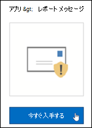
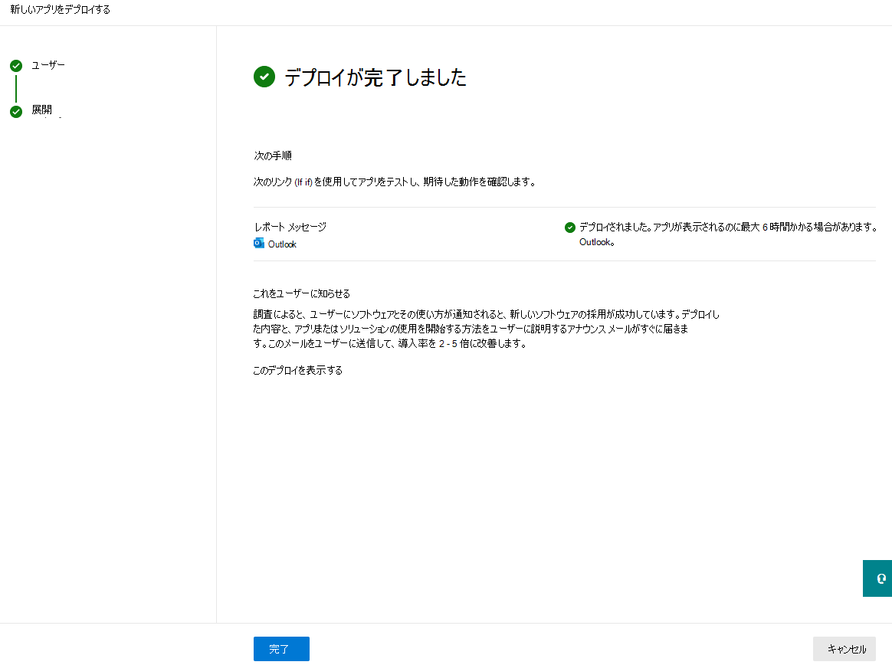
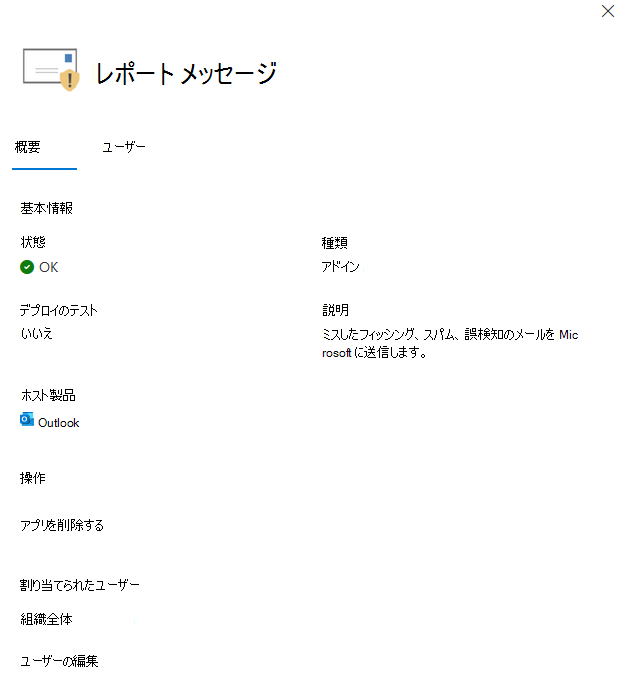
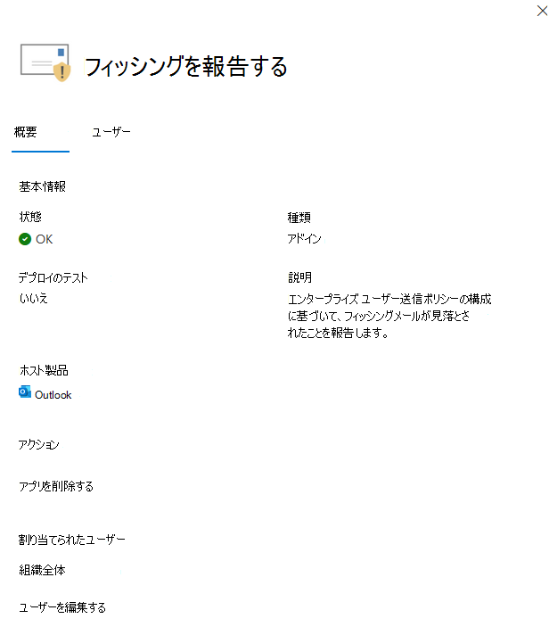

# <a name="enable-the-report-message-or-the-report-phishing-add-ins"></a>メッセージのレポートまたはフィッシング アドインのレポートを有効にする

[!INCLUDE [Microsoft 365 Defender rebranding](../includes/microsoft-defender-for-office.md)]

**適用対象**
- [Exchange Online Protection](exchange-online-protection-overview.md)
- [Microsoft Defender for Office 365 プラン 1 およびプラン 2](defender-for-office-365.md)
- [Microsoft 365 Defender](../defender/microsoft-365-defender.md)

> [!NOTE]
> 組織の管理者が Microsoft 365 メールボックスExchange Onlineしている場合は、Microsoft 365 Defender ポータルで [申請] ページを使用することをお勧めします。 詳細については、「管理申請 [を使用して疑わしい](admin-submission.md)スパム、フィッシング、URL、ファイルを Microsoft に提出する」を参照してください。

Outlook および Outlook on the web (以前は Outlook Web App と呼ばれる) のレポート メッセージとレポートフィッシング アドインを使用すると、誤検知 (悪いマークが付いた良いメール) や誤検知 (悪いメールが許可されている) を Microsoft とその関連会社に簡単に報告して分析できます。

Microsoft では、これらの申請を使用して、電子メール保護テクノロジの有効性を向上します。 たとえば、ユーザーがレポート フィッシング アドインを使用して多くのメッセージを報告するとします。 この情報は、セキュリティ ダッシュボードや他のレポートに表示されます。 組織のセキュリティ チームは、この情報をフィッシング対策ポリシーを更新する必要がある可能性を示す指標として使用できます。

レポート メッセージまたはレポート フィッシング アドインをインストールできます。 ユーザーがスパム メッセージとフィッシング メッセージの両方を報告する場合は、組織にレポート メッセージ アドインを展開します。

レポート メッセージ アドインには、スパム メッセージとフィッシング メッセージの両方を報告するオプションがあります。 管理者は、組織のレポート メッセージ アドインを有効にし、個々のユーザーが自分でインストールできます。

[フィッシングの報告] アドインには、フィッシング メッセージのみを報告するオプションがあります。 管理者は組織のレポート フィッシング アドインを有効にし、個々のユーザーが自分でインストールできます。

個々のユーザーの場合は、両方のアドインを自分で有効にできます。

グローバル管理者または Exchange Online 管理者で、Exchange が OAuth 認証を使用するように構成されている場合は、組織のレポート メッセージ アドインとレポート フィッシング アドインを有効にできます。 どちらのアドインも、集中展開を [通じて利用できます](../../admin/manage/centralized-deployment-of-add-ins.md)。

## <a name="what-do-you-need-to-know-before-you-begin"></a>はじめに把握しておくべき情報

- レポート メッセージ アドインとレポート フィッシング アドインの両方が、ほとんどのサブスクリプションとMicrosoft 365製品で動作します。
  - Outlook on the web
  - Outlook 2013 SP1 以降
  - Outlook 2016 for Mac
  - OutlookアプリにMicrosoft 365含まれているEnterprise
  - Outlook iOS と Android 用のアプリ

- 両方のアドインは、共有メールボックスでは使用できません。

- 両方のアドインは、オンプレミスおよびメールボックスExchangeできません。 

- 既存の Web ブラウザーは、レポート メッセージ アドインとレポート フィッシング アドインの両方で動作する必要があります。ただし、アドインが使用できないか、期待通り動作していない場合は、別のブラウザーを試してください。

- 組織のインストールでは、OAuth 認証を使用するように組織を構成する必要があります。 詳細については、「アドインの集中展開が組織で機能するかどうかを判断する」 [を参照してください](../../admin/manage/centralized-deployment-of-add-ins.md)。

- 管理者は、グローバル管理者役割グループのメンバーである必要があります。 詳細については、「[Microsoft 365 Defender ポータルのアクセス許可](permissions-microsoft-365-security-center.md)」を参照してください。

- レポート メッセージ機能を使用してメッセージを報告する方法の詳細については、「Report false [positives and false negatives](report-false-positives-and-false-negatives.md) in Outlook。

- URL フィルターまたはセキュリティ ソリューション (プロキシやファイアウォールなど) が設定されている組織では、HTTPS プロトコルで ipagave.azurewebsites.net エンドポイントと outlook.office.com エンドポイントにアクセスできる必要があります。

### <a name="turn-off-the-built-in-reporting-experience"></a>組み込みのレポート エクスペリエンスをオフにする

ユーザー申請ポリシーを使用できないので、Outlookに組み込みのレポート エクスペリエンスをお[勧めしません](./user-submission.md)。 代わりに、レポート メッセージ アドインまたはレポート フィッシング アドインを使用することをお勧めします。

このコマンドレットを実行する際には、あらかじめアクセス許可を割り当てる必要があります。 コマンドレットを組織内で実行するために必要になるアクセス許可とパラメーターを調べるには、「 [Find the permissions required to run any Exchange cmdlet](/powershell/exchange/find-exchange-cmdlet-permissions)」を参照してください。

次の PowerShell コマンドを実行して、組み込みのレポート エクスペリエンスを無効にします。

```powershell
Set-OwaMailboxPolicy -Identity OwaMailboxPolicy-Default -ReportJunkEmailEnabled $false
```

## <a name="get-the-report-message-add-in"></a>レポート メッセージ アドインの取得

### <a name="get-the-report-message-add-in-for-yourself"></a>自分でレポート メッセージ アドインを取得する

1. [Microsoft AppSource] に移動し <https://appsource.microsoft.com/marketplace/apps> 、レポート メッセージ アドインを検索します。 レポート メッセージ アドインに直接移動するには、に移動します <https://appsource.microsoft.com/product/office/wa104381180>。

2. [今 **すぐ取得] をクリックします**。

   

3. 表示されるダイアログで、利用規約とプライバシー ポリシーを確認し、[続行] をクリック **します**。

4. 仕事用または学校用のアカウント (ビジネス用) または Microsoft アカウント (個人用) を使用してサインインします。

アドインをインストールして有効にすると、次のアイコンが表示されます。

- このOutlookアイコンは次のように表示されます。

    > [!div class="mx-imgBorder"]
    > ![[レポート メッセージ] アドイン アイコン (Outlook)。](../../media/OutlookReportMessageIcon.png)

- このOutlook on the webアイコンは次のように表示されます。

    > [!div class="mx-imgBorder"]
    > ![Outlook on the web[レポート メッセージ] アドイン アイコンをクリックします。](../../media/owa-report-message-icon.png)

### <a name="get-the-report-message-add-in-for-your-organization"></a>組織のレポート メッセージ アドインを取得する

> [!NOTE]
> アドインが組織に表示するには、最大で 12 時間かかる場合があります。

1. [統合 [Microsoft 365 管理センター](https://admin.microsoft.com/AdminPortal/Home?#/homepage)] で、[統合 **設定** \> **] に移動します**。 [アプリ **の取得] をクリックします**。

    > [!div class="mx-imgBorder"]
    > 

2. 表示される **[Microsoft 365 Apps**] ページで、[検索] ボックスをクリックし、[レポート メッセージ] と入力し、[検索] アイコン **を**。 結果の一覧で、[レポート メッセージ] を **見つけて選択します**。 

3. アプリの詳細ページが開きます。 [今 **すぐ取得] を選択します**。 

    > [!div class="mx-imgBorder"]
    >   

4. 基本的なプロファイル情報を入力し、[続行] を **クリックします**。 

    > [!div class="mx-imgBorder"]
    > 

5. [ **新しいアプリの展開]** フライアウトが開きます。 次の設定を構成します。 [次 **へ]** をクリックして、次のページに移動してセットアップを完了します。 

   - **ユーザーの追加**: 次のいずれかの値を選択します。
     - **私だけです**
     - **組織全体**
     - **特定のユーザー/グループ**

   - **展開**:
     - **アクセス許可の要求を受け** 入れる: 次のページに進む前に、アプリのアクセス許可と機能を注意深く読んでください。

        > [!div class="mx-imgBorder"]
        > 

     - **展開の完了**: アドインの展開を確認して終了します。 
     - **展開が完了しました**: [ **完了] を選択** してセットアップを完了します。 

        > [!div class="mx-imgBorder"]
        > 

## <a name="edit-settings-for-the-report-message-add-in"></a>レポート メッセージ アドインの設定を編集する

1. [統合Microsoft 365 管理センター] に移動 **設定** \> **に移動します。** \. 次に、[レポート メッセージ] **アドインを** 見つけて選択します。

2. 表示されるフライアウトで、[ユーザーの編集] **を選択して** ユーザー設定を編集します。

    > [!div class="mx-imgBorder"]
    > 

3. アドインを削除するには、同じフライアウト **の [アクション** ] **で [アプリ** の削除] を選択します。 

## <a name="get-the-report-phishing-add-in"></a>レポートフィッシング アドインを取得する

### <a name="get-the-report-phishing-add-in-for-yourself"></a>自分でレポートフィッシング アドインを取得する

1. [Microsoft AppSource] に移動し <https://appsource.microsoft.com/marketplace/apps> 、レポートフィッシング アドインを検索します。

2. [今 **すぐ取得] をクリックします**。

3. 表示されるダイアログで、利用規約とプライバシー ポリシーを確認し、[続行] をクリック **します**。

4. 仕事用または学校用のアカウント (ビジネス用) または Microsoft アカウント (個人用) を使用してサインインします。

アドインをインストールして有効にすると、次のアイコンが表示されます。

- このOutlookアイコンは次のように表示されます。

  ![[フィッシング アドインのレポート] アイコン (Outlook)。](../../media/Outlook-ReportPhishing.png)

- このOutlook on the webアイコンは次のように表示されます。

    > [!div class="mx-imgBorder"]
    > 

### <a name="get-the-report-phishing-add-in-for-your-organization"></a>組織のレポート フィッシング アドインを取得する

> [!NOTE]
> アドインが組織に表示するには、最大で 12 時間かかる場合があります。

1. [統合 [Microsoft 365 管理センター](https://admin.microsoft.com/AdminPortal/Home?#/homepage)] で、[統合 **設定** \> **] に移動します**。 [アプリ **の取得] をクリックします**。

    > [!div class="mx-imgBorder"]
    > 

2. 表示される **[Microsoft 365 Apps**] ページで、[検索] ボックスをクリックし、[レポートフィッシング] と入力し、[検索検索] アイコン **を** 結果の一覧で、[フィッシングの報告] **を見つけて選択します**。 
 
3. アプリの詳細ページが開きます。 [今 **すぐ取得] を選択します**。

4. 基本的なプロファイル情報を入力し、[続行] を **クリックします**。

5. [ **新しいアプリの展開]** フライアウトが開きます。 上記の手順に [従ってセットアップ](enable-the-report-message-add-in.md#get-the-report-message-add-in-for-your-organization) を完了します。 

## <a name="edit-settings-for-the-report-phishing-add-in"></a>レポートフィッシング アドインの設定を編集する

1. [統合Microsoft 365 管理センター] に移動 **設定** \> **に移動します。** \. 次に、[レポートフィッシング] **アドインを** 見つけて選択します。

2. 表示されるフライアウトで、[ユーザーの編集] **を選択して** ユーザー設定を編集します。

    > [!div class="mx-imgBorder"]
    > 

3. アドインを削除するには、同じフライアウト **の [アクション** ] **で [アプリ** の削除] を選択します。 
