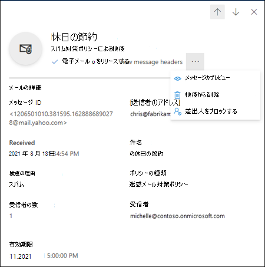

# EOP のユーザーとして検疫済みメッセージを検索して解放する

[!INCLUDE [Microsoft 365 Defender rebranding](../includes/microsoft-defender-for-office.md)]

**適用対象**
- [Exchange Online Protection](exchange-online-protection-overview.md)
- [Microsoft Defender for Office 365 プラン 1 およびプラン 2](defender-for-office-365.md)
- [Microsoft 365 Defender](../defender/microsoft-365-defender.md)

Exchange Online のメールボックスを使用している Microsoft 365 組織または Exchange Online のメールボックスを使用していないスタンドアロンの Exchange Online Protection (EOP) 組織では、危険な可能性があるメッセージまたは不要なメッセージは検疫済みメッセージとして保留されます。詳細については、「[EOP での検疫](quarantine-email-messages.md)」を参照してください。

通常のユーザー (管理者ではない) として、検疫済みのメッセージの受信者として使用できる **既定の** 機能を次の表に示します。

 

****

|検疫の理由|表示|リリース|削除|
|---|:---:|:---:|:---:|
|**スパム対策ポリシー**||||
|バルク||||
|スパム||||
|高確度スパム||||
|フィッシング||||
|高確度のフィッシング||||
|**フィッシング対策ポリシー**||||
|EOP のスプーフィング インテリジェンス保護||||
|Defender for Office 365 の偽装ユーザー保護||||
|Defender for Office 365 の偽装ドメイン保護||||
|Defender for Office 365 のメールボックス インテリジェンス保護||||
|**マルウェア対策ポリシー**||||
|マルウェアとして検疫済みの添付ファイルを含むメール メッセージ。||||
|**Defender for Office 365 の安全な添付ファイル**||||
|悪意のある添付ファイルを含むメール メッセージをマルウェアとして検疫する、安全な添付ファイル ポリシー。||||
|悪意のあるファイルをマルウェアとして検疫する SharePoint、OneDrive、Microsoft Teams 向けの安全な添付ファイル。||||
|**メール フロー ルール (トランスポート ルール)**||||
|メール メッセージを検疫するメール フロー ルール。||||
|

_検疫ポリシー_ は、[サポートされている機能](quarantine-policies.md#step-2-assign-a-quarantine-policy-to-supported-features)でメッセージが検疫された理由に基づいて、検疫済みのメッセージに対してユーザーが実行できる操作を定義します。 既定の検疫ポリシーでは、前の表で説明したように、履歴機能を適用します。 管理者は、サポートされている機能で、ユーザーの制限を緩和したり厳しくしたりする機能を定義するカスタム検疫ポリシーを作成して適用できます。 詳細については、「[検疫ポリシー](quarantine-policies.md)」を参照してください。

検疫済みのメッセージは、Microsoft 365 Defender ポータルで、または (管理者が設定している場合は) 検疫ポリシーからの検疫通知にて表示および管理します。

## はじめに把握しておくべき情報

- Microsoft 365 Defender ポータルを開くには、<https://security.microsoft.com> にアクセスします。 **"検疫"** ページに直接移動するには、<https://security.microsoft.com/quarantine> を使用します。

- 管理者は、スパム対策ポリシーでメッセージを完全に削除する前に、メッセージを検疫で保持する期間を構成できます。 検疫期間が切れたメッセージは回復できません。 詳細については、「[EOP でのスパム対策ポリシーの構成](configure-your-spam-filter-policies.md)」を参照してください。

- 既定では、高確度フィッシング、マルウェアとして検疫されるか、メール フロー ルールにより検疫済みのメッセージは、管理者のみが管理でき、ユーザーには表示されません。 詳細については、「[EOP の管理者として検疫済みのメッセージやファイルを管理する](manage-quarantined-messages-and-files.md)」を参照してください。

## 検疫済みメッセージを表示する

> [!NOTE]
> 検疫済みのメッセージを表示する機能は、検疫済みメッセージの種類に適用される[検疫ポリシー](quarantine-policies.md)によって制御されます ([検疫の理由に対する既定の検疫ポリシー](quarantine-policies.md#step-2-assign-a-quarantine-policy-to-supported-features)である可能性があります)。

1. Microsoft 365 Defender ポータルの <https://security.microsoft.com> で、**[メールとコラボレーション]** \> **[レビュー]** \> **[検疫]** に移動します。 **"検疫"** ページに直接移動するには、<https://security.microsoft.com/quarantine> を使用します。

2. **検疫** ページで、使用可能な列ヘッダーをクリックして結果を並べ替えることができます。 表示列を変更するには、[**列のカスタマイズ**] をクリックします。 既定値にはアスタリスク (\*) が付いています。

   - **受信時間**\*
   - **[件名]**\*
   - **[送信者]**\*
   - **[検疫の理由]**\*
   - **リリース状態**\*
   - **[ポリシーの種類]**\*
   - **[有効期限]**\*
   - **[受信者]**
   - **[メッセージ ID]**
   - **[ポリシー名]**
   - **メッセージ サイズ**
   - **メールの方向**

   完了したら、**[適用]** をクリックします。

3. 結果をフィルター処理するには、**[フィルター]** をクリックします。 次のフィルターは、表示される **フィルター** ポップアップで使用できます。
   - **[メッセージ ID]**: メッセージのグローバル一意識別子。
   - **[送信者のアドレス]**
   - **受信者の住所**
   - **件名**
   - **受信した時刻**: **開始時刻** と、**終了時刻**(日付) を入力します。
   - **[期限切れ日時]**: 検疫の期限が切れるタイミングでメッセージをフィルター処理します。
     - **[今日]**
     - **[今後 2 日間]**
     - **[今後 7 日間]**
     - **カスタム**: **開始時刻** と **終了時刻** (日付) を入力します。
   - **[検疫の理由]**:
     - **[バルク]**
     - **[スパム]**
     - **フィッシング**: スパム フィルター判定が **フィッシング詐欺** になったか、またはフィッシング対策保護によってメッセージが検疫されました ([スプーフィング設定](set-up-anti-phishing-policies.md#spoof-settings)または [偽装防止](set-up-anti-phishing-policies.md#impersonation-settings-in-anti-phishing-policies-in-microsoft-defender-for-office-365))。
     - **高確度のフィッシング**
   - **リリースの状態**: 次のいずれかの値。
     - **レビューが必要**
     - **承認済み**
     - **拒否された**
     - **リリースが要求されました**
     - **リリースされた**
   - **ポリシーの種類**: 次のポリシーの種類ごとに、メッセージをフィルター処理します。
     - **マルウェア対策ポリシー**
     - **安全な添付ファイルに関するポリシー**
     - **フィッシング対策ポリシー**
     - **迷惑メール対策ポリシー**

   完了したら、**[適用]** をクリックします。 フィルターをクリアするには、![[フィルターのクリア] アイコン](../../media/m365-cc-sc-clear-filters-icon.png)をクリックします。 **フィルターをクリアします**。

4. **検索** ボックスと対応する値を使用して、特定のメッセージを検索します。 ワイルドカードはサポートされていません。 次の値に基づいて検索できます。
   - メッセージ ID
   - 送信者のメール アドレス
   - 受信者のメール アドレス
   - 件名。 メッセージの件名全体を使用します。 この検索では大文字と小文字は区別されません。
   - ポリシー名。 ポリシー名全体を使用します。 この検索では大文字と小文字は区別されません。

   検索条件を入力したら、Enter キーを押して結果をフィルター処理します。

特定の検疫済みメッセージを見つけたら、そのメッセージを選択して詳細を表示し、処理を実行します (メッセージの表示、解放、ダウンロード、または削除など)。

### 検疫済みメッセージの詳細を表示する

一覧から検疫済みメッセージを選択すると、表示される詳細ポップアップに次の情報が表示されます。

一覧でメール メッセージを選択すると、**[詳細]** ポップアップ ウィンドウにメッセージに関する次の詳細が表示されます。

- **[メッセージ ID]**: メッセージのグローバル一意識別子。
- **[送信者のアドレス]**
- **[受信日時]**: メッセージを受信した日時。
- **[件名]**
- **検疫の理由**
- **ポリシーの種類**: ポリシーの種類。 たとえば、**スパム対策ポリシー**。
- **受信者の数**
- **[受信者]**: メッセージに複数の受信者が含まれている場合は、**[メッセージのプレビュー]** か **[メッセージ ヘッダーを表示]** をクリックして受信者の完全な一覧を表示する必要があります。
- **[有効期限]**: 検疫からメッセージが自動的に完全に削除される日時。

メッセージに対してアクションを実行するには、次のセクションを参照してください。

> [!NOTE]
> 詳細ポップアップに留まり、表示される検疫済みメッセージを変更するには、ポップアップの上部にある上下の矢印を使用します。
>
> 

### 検疫済みメールを処理する

> [!NOTE]
> 検疫済みのメッセージに対してアクションを実行する機能は、検疫済みメッセージの種類に適用される[検疫ポリシー](quarantine-policies.md)によって制御されます ([検疫の理由に対する既定の検疫ポリシー](quarantine-policies.md#step-2-assign-a-quarantine-policy-to-supported-features)である可能性があります)。このセクションでは、使用可能なすべてのアクションについて説明します。

一覧から検疫済みメッセージを選択すると、詳細ポップアップで次のアクションを使用できます。

- ![[メールのリリース] アイコン。](../../media/m365-cc-sc-check-mark-icon.png) **メールのリリース**\*: 受信トレイにメッセージを配信します。

- ![[メッセージ ヘッダーを表示] アイコン。](../../media/m365-cc-sc-eye-icon.png) **メッセージ ヘッダーを表示**: このリンクをクリックすると、メッセージ ヘッダー テキストが表示されます。 **メッセージ ヘッダー** ポップアップは、次のリンクと共に表示されます。
- **メッセージ ヘッダーのコピー**: メッセージ ヘッダー (すべてのヘッダー フィールド) をクリップボードにコピーするには、このリンクをクリックします。
- **Microsoft Message Header Analyzer**: ヘッダー フィールドと値を詳細に分析するには、このリンクをクリックしてメッセージ ヘッダー アナライザーに移動します。 [**分析するメッセージ ヘッダーを挿入**] セクションにメッセージ ヘッダーを貼り付けて、 (Ctrl + V キーを押すか、右クリックして [**貼り付け**] を選択します)、それから **[ヘッダーの分析]** をクリックします。

![[その他のアクション] アイコン](../../media/m365-cc-sc-more-actions-icon.png)をクリックすると、次の操作を実行できます。**その他のアクション**:

- ![[メッセージのプレビュー] アイコン。](../../media/m365-cc-sc-eye-icon.png) **メッセージのプレビュー**: 表示されるポップアップ ウィンドウで、次のいずれかのタブを選択します。
  - **[ソース]**: すべてのリンクが無効になったメッセージ本文の HTML バージョンを表示します。
  - **[プレーン テキスト]**: プレーン テキストでメッセージ本文を表示します。

- ![[検疫から削除] アイコン。](../../media/m365-cc-sc-delete-icon.png) **検疫から削除**: 表示される警告で **[はい]** をクリックすると、メッセージは直ちに削除され、元の受信者には送信されません。

- ![[メッセージをダウンロード] アイコン。](../../media/m365-cc-sc-download-icon.png) **メールをダウンロード**: 表示されるポップアップ ウィンドウで、 **[このメッセージをダウンロードするリスクを理解しています]** を選択し、**[ダウンロード]** をクリックして、メッセージのローカル コピーを .eml 形式で保存します。

- ![[送信者ブロック] アイコン。](../../media/m365-cc-sc-block-sender-icon.png) **送信者のブロック**: **メールボックス** の [ブロックされた送信者] リストに送信者を追加します。 詳細については、「[メール送信者をブロックする](https://support.microsoft.com/office/b29fd867-cac9-40d8-aed1-659e06a706e4)」を参照してください。

\* このオプションは、既に解放されているメッセージでは使用できません (**[リリース済み] 状態** の値は **[リリース済み]**)。

メッセージを解放も削除もしないと、既定の検疫保持期間が経過した後に削除されます(**Expires** 列に表示されているように)。

> [!NOTE]
> モバイル デバイスでは、説明テキストはアクション アイコン用に使用できません。
>
> 
>
> アイコンの順序と対応する説明を次の表にまとめます。
>
> |アイコン|説明|
> |---:|---|
> |![[メールを解放する] アイコン。](../../media/m365-cc-sc-check-mark-icon.png)|**メールを解放する**|
> |![[メッセージ ヘッダーを表示する] アイコン。](../../media/m365-cc-sc-eye-icon.png)|**メッセージ ヘッダーを表示する**|
> |![[メッセージのプレビュー] アイコン。](../../media/m365-cc-sc-eye-icon.png)|**メッセージのプレビュー**|
> |![[検疫から削除] アイコン。](../../media/m365-cc-sc-delete-icon.png)|**検疫から削除**|
> |![[差出人をブロックする] アイコン。](../../media/m365-cc-sc-block-sender-icon.png)|**差出人をブロックする**|

#### 複数の検疫済みメール メッセージを処理する

最初の列の左側にある空白の領域をクリックして、一覧で複数の検疫済みメッセージ (最大 100) を選択すると、次の操作を実行できる **[一括操作]** ドロップダウン リストが表示されます。

![検疫内のメッセージの [一括アクション] ドロップダウン リスト。](../../media/quarantine-user-message-bulk-actions.png)

- ![[メールを解放する] アイコン。](../../media/m365-cc-sc-check-mark-icon.png) **メールを解放する**: 受信トレイにメッセージを配信します。
- ![[検疫から削除] アイコン。](../../media/m365-cc-sc-delete-icon.png) **メッセージの削除**: 表示される警告で **[はい]** をクリックすると、メッセージは元の受信者に送信されずに検疫から直ちに削除されます。
