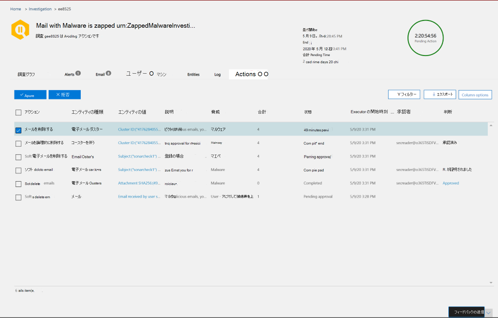

# Office 365 で配信された悪意のあるメールを修復する

[!INCLUDE [MDO Trial banner](../includes/mdo-trial-banner.md)]

**適用対象**
- [Microsoft Defender for Office 365 プラン 2](defender-for-office-365.md)

修復とは、脅威に対して所定のアクションを実行することです。 組織に送信された悪意のあるメールは、システム、ゼロ時間の自動消去 (ZAP)、またはセキュリティ チームによって *、受信トレイへの移動*、 *迷惑メールへの移動*、 *削除済みアイテムへの移動*、 *論理的な削除*、 *ハード削除* などの修復アクションを通じてクリーンアップできます。 Microsoft Defender for Office 365計画 2/E5 を使用すると、セキュリティ チームは手動および自動調査を通じて、電子メールとコラボレーション機能の脅威を修復できます。

> [!NOTE]
> 悪意のあるメールを修復するには、セキュリティ チームに *Search ロールと Purge* ロールが割り当てられている必要があります。 ロールの割り当ては、[Microsoft 365 Defender ポータルのアクセス許可によって](permissions-microsoft-365-security-center.md)行われます。

## 開始する前に知っておくべきこと

管理者は電子メールに対して必要なアクションを実行できますが、それらのアクションを承認するには、Microsoft 365 Defender ポータルの **電子メール & コラボレーション** アクセス許可で *、それらのユーザーに対して検索ロールと消去* ロールが割り当てられている必要があります。 ロール グループの 1 つに検索 *と消去"* ロールを追加しないと、アクションを実行できません。

電子メール アクションはバックエンドで自動調査を作成するため、 *自動調査* を有効にする必要があります。 **[設定** \> **Endpoints** \> **Advanced 機能**] に移動し、[**自動調査]** をオンにします。

## 手動修復と自動修復

*手動ハンティング* は、セキュリティ チームがエクスプローラーの検索機能とフィルター処理機能を使用して手動で脅威を識別するときに発生します。 手動の電子メール修復は、修復する必要がある一連のメールを特定した後、任意の電子メール ビュー (*マルウェア*、 *フィッシング*、または *すべての* メール) を介してトリガーできます。

:::image type="content" source="../../media/microsoft-365-defender-threat-explorer-manual-remediation.png" alt-text="Office 365 エクスプローラーでの手動ハンティングのスクリーンショット。":::

セキュリティ チームはエクスプローラーを使用して、いくつかの方法でメールを選択できます。

- 電子メールを手動で選択する:さまざまなビューでフィルターを使用します。 修復するメールを最大 100 件選択します。

- クエリの選択: 上部の [すべて選択] ボタンを使用してクエリ全体 **を選択します** 。 アクション センターのメール送信の詳細にも、同じクエリが表示されます。 お客様は、脅威エクスプローラーから最大 200,000 件のメールを送信できます。  

- 除外されたクエリの選択: セキュリティ運用チームは、クエリ全体を選択し、クエリから特定のメールを手動で除外することで、メールを修復したい場合があります。 これを行うには、管理者は **[すべて選択** ] チェック ボックスを使用し、下にスクロールしてメールを手動で除外できます。 クエリには、最大 1,000 件のメールを保持できます。 除外の最大数は 100 です。

エクスプローラーで電子メールを選択したら、直接アクションを実行するか、アクションのメールをキューに入れて修復を開始できます。

- 直接承認: 適切なアクセス許可を持つセキュリティ担当者が *受信トレイへの移動*、 *迷惑メールへの移動*、 *削除済みアイテムへの移動*、 *論理的な削除*、 *ハード削除* などのアクションを選択し、修復の次の手順に従うと、選択したアクションの実行が開始されます。
> [!NOTE]
> 修復が開始されると、アラートと調査が並行して生成されます。 アラートは、"管理者によって送信された管理アクション" という名前のアラート キューに表示され、セキュリティ担当者がエンティティを修復するアクションを実行したことを示します。 アクションを実行したユーザーの名前、調査リンクのサポート、時間などの詳細が表示されます。エンティティに対して修復などの厳しいアクションが実行されるたびに、非常に効果的です。 これらのアクションはすべて、[ **アクション&申請** \> **アクション センター**  -> **履歴] タブ** (パブリック プレビュー) で追跡できます。

- 2 段階承認: 適切なアクセス許可を持っていない管理者や、アクションの実行を待機する必要がある管理者は、"修復に追加" アクションを実行できます。 この場合、対象となる電子メールが修復コンテナーに追加されます。 修復が実行される前に承認が必要です。

**自動調査と応答** アクションは、アラートまたはエクスプローラーのセキュリティ運用チームによってトリガーされます。 これには、セキュリティ運用チームによって承認される必要がある推奨される修復アクションが含まれる場合があります。 これらのアクションは、自動調査の [ **アクション** ] タブに含まれています。

> [!div class="mx-imgBorder"]
> 

エクスプローラー、高度な捜索、または自動調査によって作成されたすべての修復 (直接承認) は、アクション センターに表示されます。 左側のナビゲーション パネルの [ **アクション&送信** \> **アクション センター**  -> **の履歴] タブ** からアクセスします。

エクスプローラーまたは高度な捜索または自動調査によって作成されたすべての修復 (直接承認) は、アクション センターに表示されます。 左側のナビゲーション パネルの [ **アクション&送信** \> **アクション センター**  -> **の履歴] タブ** からアクセスします。 

2 段階の承認プロセスを使用して承認を保留中の手動アクション (1. 1 人のセキュリティ運用チーム メンバー (2) によって修復に追加されます。 別のセキュリティ運用チーム メンバーによってレビューおよび承認された場合) は、従来のDefender for Office 365 アクション センター **のレビュー** \> **アクション センター** にのみ表示され、インシデント/調査および統合アクション センターには表示されません。

> [!NOTE]
> 2 段階承認: Office アクション センター **のレビュー** \> **アクション センター** でのみ使用できるアクション

:::image type="content" source="../../media/microsoft-365-defender-action-center-history.png" alt-text="統合アクション センターには、30 日間の修復アクションが表示されます。":::

統合アクション センターには、過去 30 日間の修復アクションが表示されます。 エクスプローラーを介して実行されたアクションは、修復の作成時にセキュリティ運用チームが指定した名前と承認 ID、調査 ID によって一覧表示されます。自動調査を通じて実行されるアクションには、 *Zap 電子メール クラスター* などの調査をトリガーした関連アラートで始まるタイトルがあります。

修復項目を開き、修復名、承認 ID、調査 ID、作成日、説明、状態、アクション ソース、アクションの種類、決定者、状態など、その修復項目の詳細を表示します。 また、アクションの詳細、電子メール クラスターの詳細、アラート、インシデントの詳細を含むサイド ウィンドウも開きます。

- *[調査] ページを開* くと、詳細とタブの数が少ない管理者の調査が開きます。 これには、関連するアラート、修復用に選択されたエンティティ、実行されたアクション、修復状態、エンティティ数、ログ、アクションの承認者などの詳細が表示されます。 この調査では、管理者が手動で行った調査を追跡し、管理者が行った選択の詳細が含まれているので、管理者アクション調査と呼ばれます。 調査に対応し、既に承認された状態でアラートを送信する必要はありません。
- *電子メール数* 脅威エクスプローラーから送信された電子メールの数を表示します。 これらの電子メールは、アクション可能であるか、または実行可能でない可能性があります。
- *アクション ログ* 成功、失敗、既に宛先にあるなどの修復状態の詳細を表示します。

:::image type="content" source="../../media/microsoft-365-defender-action-center-history-panel.png" alt-text="[受信トレイに移動] オプションが開いているアクション センター。":::

  - **実行可能:** 次のクラウド メールボックスの場所にある電子メールは、操作および移動できます。
    - 受信トレイ
    - 迷惑メール
    - フォルダーの削除
    - 論理的に削除されたフォルダー

      > [!NOTE]
      > 現時点では、メールボックスにアクセスできるユーザーのみが、論理的に削除されたフォルダーからアイテムを回復できます。

  - **対処できない**: 次の場所の電子メールは、修復アクションで操作または移動できません。
    - 検疫する
    - ハード削除されたフォルダー
    - オンプレミス/外部
    - 失敗/削除済み

  疑わしいメッセージは、修復可能または修復不可能のいずれかに分類されます。 ほとんどの場合、修復可能なメッセージと修復不可能なメッセージの組み合わせには、送信されたメッセージの合計が等しくなります。 ただし、まれにこれは当てはまらない場合があります。 これは、システムの遅延、タイムアウト、または期限切れのメッセージが原因で発生する可能性があります。 メッセージは、組織のエクスプローラーの保有期間に基づいて期限切れになります。

  組織のエクスプローラーの保持期間後に古いメッセージを修復する場合を除き、番号の不整合が発生した場合は、アイテムの修復を再試行することをお勧めします。 システム遅延の場合、通常、修復更新プログラムは数時間以内に更新されます。

  エクスプローラーでの組織の電子メールの保有期間が 30 日間で、29 日から 30 日前にメールを修復する場合、メール送信数が常に加算されるとは限りません。 電子メールは、既に保持期間から移行し始めている可能性があります。

  修復がしばらくの間 "進行中" 状態で停止している場合は、システムの遅延が原因である可能性があります。 修復には最大で数時間かかる場合があります。 システムの遅延が原因で、修復開始時に一部のメールにクエリが含まれていない可能性があるため、メール送信数のバリエーションが表示される場合があります。 このような場合は、修復を再試行することをお勧めします。

  > [!NOTE]
  > 最適な結果を得るには、修復を 50,000 以下のバッチで行う必要があります。

  修復中は、修復可能な電子メールのみが処理されます。 Office 365電子メール システムでは、クラウド メールボックスに保存されないため、修復できないメールを修復できません。

  管理者は、必要に応じて検疫内のメールに対してアクションを実行できますが、手動で削除しないと、それらのメールは検疫から期限切れになります。 既定では、悪意のあるコンテンツが原因で検疫されたメールにはユーザーがアクセスできないため、セキュリティ担当者は検疫内の脅威を取り除くために何も操作する必要はありません。 電子メールがオンプレミスまたは外部の場合、ユーザーに連絡して疑わしいメールに対処できます。 または、管理者は、削除に個別の電子メール サーバー/セキュリティ ツールを使用できます。 これらの電子メールは、 *エクスプローラーで配信場所 = オンプレミス* の外部フィルターを適用することで識別できます。 失敗または削除された電子メールの場合、またはユーザーがアクセスできないメールの場合、これらのメールはメールボックスに届かないため、軽減するメールはありません。

 
- **アクション ログ**: 既に宛先に修復、成功、失敗したメッセージが表示されます。

  状態は次のとおりです。

  - **開始済み**: 修復がトリガーされます。
    - **Queued**: 修復は、電子メールの軽減のためにキューに登録されます。
    - **進行中**: 軽減策が進行中です。
    - **完了:** 修復可能なすべてのメールに対する軽減策は、正常に完了したか、一部のエラーが発生した場合です。
    - **失敗:** 修復は成功しなかった。

  修復可能なメールのみを処理できるため、各メールのクリーンアップは成功または失敗として表示されます。 修復可能なメールの合計数から、成功した軽減策と失敗した軽減策が報告されます。

  - **成功**: 修復可能な電子メールに対して必要なアクションが完了しました。 たとえば、管理者はメールボックスからメールを削除して、管理者がメールを論理的に削除する操作を行う必要があります。 アクションの実行後に元のフォルダーに修復可能な電子メールが見つからない場合、状態は成功として表示されます。

  - **失敗**: 修復可能なメールに対して必要なアクションが失敗しました。 たとえば、管理者はメールボックスからメールを削除して、管理者がメールを論理的に削除する操作を行う必要があります。 アクションの実行後に修復可能な電子メールがメールボックスにまだ見つかった場合、状態は失敗として表示されます。
  
  - **既に送信先: 目的の** アクションは、電子メールまたは宛先の場所に既に存在する電子メールに対して既に実行されました。 たとえば、1 日目にエクスプローラーを介して管理者によってメールが論理的に削除されました。 その後、同様のメールが 2 日目に表示され、管理者によって再び論理的に削除されます。これらのメールを選択すると、管理者は、既に論理的に削除されている初日からメールを選択します。 これで、これらの電子メールは再び処理されず、宛先の場所に存在していたとおりにアクションが実行されなかったため、"既に宛先" として表示されます。

  - **新規**: [アクション ログ *] に [既に挿入済み] 列* が追加されました。 この機能では、脅威エクスプローラーの最新の配信場所を使用して、メールが既に修復されているかどうかを通知します。 *既に宛先にいる* 場合、セキュリティ チームは、まだ対処する必要があるメッセージの合計数を理解するのに役立ちます。

アクションは、脅威エクスプローラーの受信トレイ、迷惑メール、削除済みフォルダー、論理的な削除済みフォルダー内のメッセージに対してのみ実行できます。 新しい列の動作の例を次に示します。 受信トレイに存在するメッセージに対して *論理的な削除アクション* が実行され、ポリシーに従ってメッセージが処理されます。 次に論理的な削除が実行されると、このメッセージは列 '既に宛先' の下に表示され、再び対処する必要がないことを示します。

アクション ログ内の任意の項目を選択して、修復の詳細を表示します。 詳細が "成功" または "メールボックスに見つかりません" と表示された場合、そのアイテムは既にメールボックスから削除されました。 修復中にシステム エラーが発生することがあります。 このような場合は、修復アクションを再試行することをお勧めします。

大量のメールを修復する場合は、メール送信を介して修復のために送信されたメッセージと、アクション ログを介して修復されたメッセージをエクスポートします。 エクスポートの制限は 100,000 レコードに引き上げます。

 管理者は、電子メール メッセージを迷惑メール、受信トレイ、または削除済みアイテム フォルダーに移動するなどの修復アクションを実行し、高度なハンティング ページから論理的な削除やハード削除などのアクションを削除できます。

:::image type="content" source="../../media/microsoft-365-defender-advanced-hunting-actions-pane.png" alt-text="[高度なハンティング]、[アクションの実行] パネルで、任意のアクションを選択できます。":::

修復は、脅威を軽減し、疑わしいメールに対処し、組織のセキュリティを維持するのに役立ちます。
