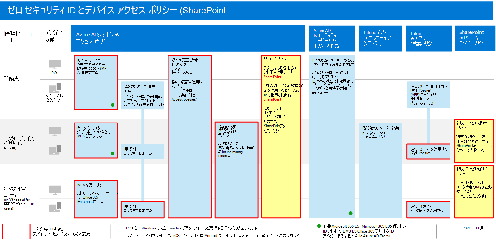
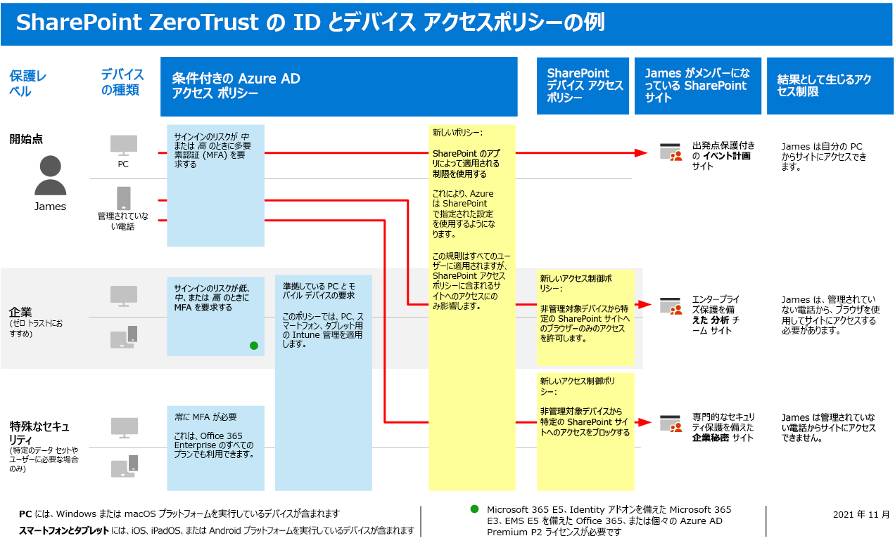

# SharePoint サイトおよびファイルをセキュリティで保護するためのポリシーの推奨事項

**適用対象**
- [Exchange Online Protection](exchange-online-protection-overview.md)
- [Microsoft Defender for Office 365 プラン 1 およびプラン 2](defender-for-office-365.md)
- SharePoint Online 

この記事では、推奨される ID ポリシーとデバイス アクセス ポリシーを実装して、ユーザーとユーザーを保護するSharePoint説明OneDrive for Business。 このガイダンスは、共通の [ID ポリシーとデバイス アクセス ポリシーを基にしています](identity-access-policies.md)。

これらの推奨事項は、ニーズの粒度に基づいて適用できる SharePoint ファイルのセキュリティと保護の 3 つの層に基づいて行います。ベースライン、機密性の高い、高度に規制 **されています**。 これらのセキュリティ層と、これらの推奨事項で参照される推奨クライアント オペレーティング システムの詳細については、「概要」 [を参照してください](microsoft-365-policies-configurations.md)。

このガイダンスの実装に加えて、機密および規制の厳しいコンテンツに対する適切なアクセス許可の設定など、適切な保護SharePointサイトを構成してください。

## 一般的なポリシーを更新して、SharePointとOneDrive for Business

次の図は、SharePointおよび OneDriveのファイルを保護するために、共通の ID およびデバイス アクセス ポリシーから更新するポリシーを示しています。

共通ポリシーをSharePointに追加した場合は、新しいポリシーのみを作成する必要があります。 条件付きアクセス ポリシーの場合、SharePointがOneDrive。

新しいポリシーでは、指定したサイトに特定のアクセス要件を適用することで、機密性の高い規制のSharePointデバイス保護を実装します。

次の表に、新しいポリシーを確認および更新または作成する必要があるポリシーを示SharePoint。 共通ポリシーは、「共通 ID とデバイス アクセス ポリシー」の記事に関連付けられた構成 [手順にリンク](identity-access-policies.md) します。

|保護レベル|ポリシー|詳細情報|
|---|---|---|
|**Baseline**|[サインイン リスクが中程度または高の場合に MFA *を* 要求 *する*](identity-access-policies.md#require-mfa-based-on-sign-in-risk)|クラウド SharePoint割り当てにアプリを含める。|
||[先進認証をサポートしないクライアントはブロックする](identity-access-policies.md#block-clients-that-dont-support-multi-factor)|クラウド SharePoint割り当てにアプリを含める。|
||[APP データ保護ポリシーの適用](identity-access-policies.md#apply-app-data-protection-policies)|すべての推奨アプリがアプリの一覧に含まれているか確認してください。 各プラットフォーム (iOS、Android、Windows) のポリシーを更新してください。|
||[準拠 PC が必要](identity-access-policies.md#require-compliant-pcs-but-not-compliant-phones-and-tablets)|クラウド SharePointリストにアプリを含める。|
||[アプリで適用される制限を使用SharePoint](#use-app-enforced-restrictions-in-sharepoint)|この新しいポリシーを追加します。 これにより、Azure Active Directory (Azure AD) で指定された設定を使用SharePoint。 このポリシーは、すべてのユーザーに適用されますが、アクセス ポリシーに含まれるサイトSharePoint影響します。|
|**機密**|[サインイン リスクが低い、中程度、または高い場合に MFA *を* 要求 *する*](identity-access-policies.md#require-mfa-based-on-sign-in-risk)|クラウド SharePoint割り当てにアプリを含める。|
||[準拠している PC とモバイル *デバイスを* 要求する](identity-access-policies.md#require-compliant-pcs-and-mobile-devices)|クラウド SharePointリストにアプリを含める。|
||[SharePointアクセス制御ポリシー](#sharepoint-access-control-policies): 管理されていないデバイスから特定のサイトへのブラウザー SharePointアクセスを許可します。|これにより、ファイルの編集とダウンロードが防止されます。 PowerShell を使用してサイトを指定します。|
|**厳しく規制**|[*常に* MFA を要求する](identity-access-policies.md#require-mfa-based-on-sign-in-risk)|クラウド SharePoint割り当てにアプリを含める。|
||[SharePointアクセス制御ポリシー](#use-app-enforced-restrictions-in-sharepoint): 管理されていないデバイスから特定のSharePointサイトへのアクセスをブロックします。|PowerShell を使用してサイトを指定します。|
|

## アプリで適用される制限を使用SharePoint

SharePoint でアクセス制御を実装する場合は、Azure AD でこの条件付きアクセス ポリシーを作成して、SharePoint で構成したポリシーを適用するように Azure AD に伝える必要があります。 このポリシーはすべてのユーザーに適用されますが、PowerShell を使用して指定したサイトへのアクセスに影響を与えるのは、PowerShell でアクセス制御を作成するときにのみSharePoint。

このポリシーを構成するには、「管理されていないデバイスからのアクセスを制御する」の「SharePoint サイト コレクションまたは OneDrive アカウントへのアクセスをブロックまたは制限する」[を参照してください](/sharepoint/control-access-from-unmanaged-devices)。

## SharePointアクセス制御ポリシー

Microsoft では、デバイス アクセス制御を使用してSharePoint規制の厳しいコンテンツを使用して、サイト内のコンテンツを保護することを推奨します。 これを行うには、保護のレベルと保護を適用するサイトを指定するポリシーを作成します。

- 機密性の高いサイト: ブラウザー専用のアクセスを許可します。 これにより、ユーザーはファイルを編集およびダウンロードできます。
- 高度に規制されたサイト: 管理されていないデバイスからのアクセスをブロックします。

「管理されていないデバイスからのアクセスを制御する」の「SharePointサイト コレクションまたは OneDrive アカウントへのアクセスをブロックまたは制限する」[を参照してください](/sharepoint/control-access-from-unmanaged-devices)。

## これらのポリシーの動作

通常、サイトのアクセス許可のSharePointは、サイトへのアクセスに関するビジネス上の必要性に基づいて行なう必要があります。 これらのアクセス許可は、サイトの所有者によって管理され、非常に動的な場合があります。 デバイス SharePoint ポリシーを使用すると、ベースライン保護、機密性の高い保護、または厳しく規制された保護に関連付けられた Azure AD グループにユーザーが割り当てられているかどうかに関係なく、これらのサイトを保護できます。

次の図は、デバイス アクセス ポリシーを使用SharePointサイトへのアクセスを保護する方法の例を示しています。

[このイメージのより大きなバージョンを表示する](https://github.com/MicrosoftDocs/microsoft-365-docs/raw/public/microsoft-365/media/microsoft-365-policies-configurations/SharePoint-rules-scenario.png)

James には基準となる条件付きアクセス ポリシーが割り当て済みですが、機密性の高い保護または高度に規制されたSharePointサイトへのアクセス権を与えられる可能性があります。

- James が自分の PC を使用するメンバーである機密性の高い、または規制の厳しいサイトにアクセスした場合、自分の PC が準拠している限り、アクセスが許可されます。
- James が管理されていない電話を使用するメンバーである機密性の高いサイトにアクセスした場合、このサイト用に構成されたデバイス アクセス ポリシーにより、機密性の高いサイトへのブラウザー専用アクセスを受け取る必要があります。
- James が管理されていない電話を使用するメンバーである規制の厳しいサイトにアクセスすると、このサイト用に構成されたアクセス ポリシーが原因でブロックされます。 このサイトにアクセスできるのは、管理および準拠している PC を使用する場合のみです。

## 次の手順

次の条件付きアクセス ポリシーを構成します。

- [Microsoft Teams](teams-access-policies.md)
- [Exchange Online](secure-email-recommended-policies.md)