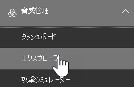

# 脅威エクスプローラーとリアルタイム検出

**適用対象**
- [Microsoft Defender for Office 365 プラン 1 およびプラン 2](defender-for-office-365.md)
- [Microsoft 365 Defender](../defender/microsoft-365-defender.md)

組織が microsoft [Defender for Office 365](defender-for-office-365.md)を持ち、必要 なアクセス許可を持っている場合は、エクスプローラーまたはリアルタイム検出 **(以前** のリアルタイム レポート *-* 新機能を参照してください)。  セキュリティ コンプライアンス センター&に移動し、[脅威の管理] に移動し、[**エクスプローラー**  ] または [リアルタイム検出 **] を選択します**。

 

****

|Microsoft Defender for Office 365プラン 2 では、次の情報が表示されます。|Microsoft Defender for Office 365プラン 1 では、次の情報が表示されます。|
|---|---|
|||
|

エクスプローラーまたはリアルタイム検出は、セキュリティ運用チームが脅威を効率的に調査して対応するのに役立ちます。 レポートは次の図のようになります。

![[脅威管理エクスプローラー] に \> 移動します。](../../media/cab32fa2-66f1-4ad5-bc1d-2bac4dbeb48c.png)

このレポートでは、次の機能を使用できます。

- [セキュリティ機能によって検出されたマルウェアMicrosoft 365表示する](#see-malware-detected-in-email-by-technology)
- [フィッシング URL を表示し、[評決データ] をクリックする](#view-phishing-url-and-click-verdict-data)
- [エクスプローラーでビューから自動調査と](#start-automated-investigation-and-response)応答プロセスを開始する (Defender for Office 365プラン 2 のみ)
- [悪意のあるメールの調査など](#more-ways-to-use-explorer-and-real-time-detections)

## 脅威ハンティング エクスペリエンスの改善

### エクスプローラー/リアルタイム検出内Office 365 Defender のアラート ID の概要

今日、アラートから脅威エクスプローラーに移動すると、エクスプローラー内でフィルター処理されたビューが開き、そのビューはアラート ポリシー ID (ポリシー ID はアラート ポリシーの一意の識別子) でフィルター処理されます。
脅威エクスプローラーとリアルタイム検出でアラート ID (以下のアラート ID の例を参照) を導入して、特定のアラートに関連するメッセージと電子メールの数を確認することで、この統合の関連性を高めます。 また、メッセージがアラートの一部だったか、そのメッセージから特定のアラートに移動したのかも確認できます。

アラート ID は、個々のアラートを表示するときに URL 内で使用できます。の例を示します `https://protection.office.com/viewalerts?id=372c9b5b-a6c3-5847-fa00-08d8abb04ef1` 。

> [!div class="mx-imgBorder"]
> 

> [!div class="mx-imgBorder"]
> 

### 試用版テナントのエクスプローラー (およびリアルタイム検出) のデータ保持と検索の制限を 7 日から 30 日間に延長する

この変更の一環として、Office P1 および P2 試用版テナントの両方の Defender の脅威エクスプローラー/リアルタイム検出で、30 日間 (前の 7 日間から増加) のメール データを検索およびフィルター処理できます。
これは、既に 30 日間のデータ保持および検索機能を備えた P1 および P2/E5 の両方の顧客の実稼働テナントには影響を与えかねない。

### 脅威エクスプローラーのレコードのエクスポートの制限を更新しました

この更新プログラムの一環として、Threat Explorer からエクスポートできる電子メール レコードの行数が 9990 から 200,000 レコードに増加しました。 現在エクスポートできる列のセットは同じままですが、行数は現在の制限値から増加します。

### 脅威エクスプローラーのタグ

> [!NOTE]
> ユーザー タグ機能は [ *プレビュー] で*、すべてのユーザーが利用できるとは言え、変更される可能性があります。 リリース スケジュールの詳細については、次のロードマップMicrosoft 365してください。

ユーザー タグは、Microsoft Defender のユーザーの特定のグループを特定Office 365。 ライセンスや構成などのタグの詳細については、「User tags」 [を参照してください](user-tags.md)。

Threat Explorer では、次のエクスペリエンスでユーザー タグに関する情報を確認できます。

#### メール グリッド ビュー

メール **グリッドの** [タグ] 列には、送信者または受信者のメールボックスに適用されたタグすべてが含まれます。 既定では、優先アカウントのようなシステム タグが最初に表示されます。

> [!div class="mx-imgBorder"]
> 

#### フィルター処理

タグはフィルターとして使用できます。 優先度の高いアカウントまたは特定のユーザー タグのシナリオ間でハントします。 特定のタグを持つ結果を除外することもできます。 この機能を他のフィルターと組み合わせて、調査範囲を絞り込む。

> [!div class="mx-imgBorder"]
> 

#### 電子メールの詳細の飛び出し

送信者と受信者の個々のタグを表示するには、件名を選択してメッセージの詳細のフライアウトを開きます。 [概要 **] タブ** で、送信者と受信者のタグが電子メールに存在する場合は、個別に表示されます。
送信者と受信者の個々のタグに関する情報は、エクスポートされた CSV データにも拡張され、これらの詳細は 2 つの個別の列で確認できます。

> [!div class="mx-imgBorder"]
> 

タグ情報は、URL クリック のフライアウトにも表示されます。 表示するには、[フィッシング] または [すべてのメール] ビューに移動し **、[URL]** または [URL クリック] **タブに移動** します。個々の URL フライアウトを選択して、その URL のクリックに関する詳細 (そのクリックに関連付けられたタグを含む) を表示します。

### 更新されたタイムライン ビュー

> [!div class="mx-imgBorder"]
> 
>
[このビデオ](https://www.youtube.com/watch?v=UoVzN0lYbfY&list=PL3ZTgFEc7LystRja2GnDeUFqk44k7-KXf&index=4)を見て詳細をご確認ください。

## 脅威の検出エクスペリエンスの改善 (今後)

### 電子メールの更新された脅威情報

電子メール レコードのデータの精度と一貫性を高めるプラットフォームとデータ品質の向上に重点を置いて取り組み、 ZAP プロセスの一部として電子メールで実行されるアクションなど、配信前および配信後の情報を 1 つのレコードに統合する機能が強化されています。 スパムの評決、エンティティ レベルの脅威 (悪意のある URL など)、最新の配信場所などの詳細も含まれています。

これらの更新後、メッセージに影響を与える配信後のイベントに関係なく、メッセージごとに 1 つのエントリが表示されます。 アクションには、ZAP、手動修復 (管理者アクションを意味する)、動的配信などがあります。

マルウェアやフィッシングの脅威を表示する以外にも、メールに関連付けられたスパムの評決が表示されます。 電子メール内で、対応する検出テクノロジと共に、電子メールに関連付けられているすべての脅威を確認します。 電子メールには、0、1、または複数の脅威を含む可能性があります。 メール の飛び出しの [ **詳細** ] セクションに現在の脅威が表示されます。 複数の脅威 (マルウェアやフィッシングなど) の場合、[検出] 技術フィールドには、脅威を特定した検出テクノロジである脅威検出マッピングが表示されます。

一連の検出テクノロジには、新しい検出方法とスパム検出テクノロジが含まれています。 同じ一連の検出テクノロジを使用して、さまざまな電子メール ビュー (マルウェア、フィッシング、すべてのメール) で結果をフィルター処理できます。

> [!NOTE]
> 評決分析は必ずしもエンティティに関連付けられているとは限りません。 たとえば、電子メールはフィッシングまたはスパムとして分類されますが、フィッシング/スパムの評決でスタンプされた URL はありません。 これは、フィルターが、評決を割り当てる前に、メールのコンテンツなどの詳細も評価する理由です。

#### URL 内の脅威

[メール の飛び出しの詳細] タブで、URL の特定の脅威を **確認** できます。脅威には、マルウェア *、フィッシング*、*スパム、* または *なしがあります*。 

> [!div class="mx-imgBorder"]
> 

### 更新されたタイムライン ビュー (今後)

> [!div class="mx-imgBorder"]
> 

タイムライン ビューは、すべての配信イベントと配信後イベントを識別します。 この情報には、これらのイベントのサブセットについて、その時点で特定された脅威に関する情報が含まれます。 タイムライン ビューでは、追加のアクション (ZAP や手動修復など) に関する情報も、そのアクションの結果と共に提供されます。 タイムライン ビューの情報には、次の情報が含まれます。

- **ソース:** イベントのソース。 管理者/システム/ユーザーを指定できます。
- **イベント:** 元の配信、手動修復、ZAP、申請、動的配信などのトップ レベルのイベントが含まれます。
- **アクション:** ZAP または管理アクションの一部として実行された特定のアクション (たとえば、ソフト削除)。
- **脅威:** その時点で特定された脅威 (マルウェア、フィッシング、スパム) をカバーします。
- **結果/詳細:** ZAP/admin アクションの一部として実行されたかどうかなど、アクションの結果に関する詳細。

### 元の配信場所と最新の配信場所

現在、メール グリッドと電子メール のフライアウトで配信場所を表示しています。 [**配信場所]** フィールドの名前が [元の配信場所 **_] _に_*変更されています。また、別のフィールド _最新の* 配信場所 _を導入しています_**。

**元の配信場所** では、メールが最初に配信された場所に関する詳細が表示されます。 **最新の配信場所** には *、ZAP* や削除済みアイテムへの移動のような管理アクションなど、システムアクションの後にメールが届 *いた場所が表示されます*。 最新の配信場所は、メッセージの配信後の最後の既知の場所、またはシステム/管理者のアクションを管理者に伝える目的です。 電子メールにはエンド ユーザーのアクションは含めかねない。 たとえば、ユーザーがメッセージを削除した場合、またはメッセージをアーカイブ/pst に移動した場合、メッセージ "配信" の場所は更新されません。 ただし、システム アクションによって場所が更新された場合 (たとえば、ZAP が検疫に移動する電子メールなど)、最新の配信場所は "検疫" として表示されます。

> [!div class="mx-imgBorder"]
> 

> [!NOTE]
> 配信場所と配信アクションが"不明"と表示される場合があります。
>
> - メッセージ **が配信された** 場合、配信場所は"配信済み"、配信場所は "不明" と表示される場合がありますが、受信トレイ ルールはメッセージを受信トレイまたは迷惑メール フォルダーではなく既定のフォルダー (下書きやアーカイブなど) に移動します。
>
> - **管理者/システム** アクション (ZAP など) が試行されたが、メッセージが見つからなかった場合、最新の配信場所が不明になる可能性があります。 通常、アクションは、ユーザーがメッセージを移動または削除した後に実行されます。 このような場合は、タイムライン ビューの **[結果/詳細]** 列を確認します。 "ユーザーが移動または削除したメッセージ" というステートメントを探します。

> [!div class="mx-imgBorder"]
> 

### その他のアクション

*電子メールの* 配信後に追加のアクションが適用された。 *ZAP、* 手動修復 *(ソフト* 削除などの管理者が実行したアクション)、動的配信、および再処理 *(さかのぼ* って良好と検出された電子メールの場合) が含まれます。

> [!NOTE]
> 保留中の変更の一環として、[配信アクション] フィルターに現在表示されている "削除済み" の値は削除されます。 追加アクションを通じて ZAP の試行ですべてのメールを **検索する方法があります**。

> [!div class="mx-imgBorder"]
> 

### システムオーバーライド

*システムオーバーライドを使用* すると、メッセージの意図した配信場所に対して例外を作成できます。 システムによって提供される配信場所は、フィルター スタックによって識別される脅威や他の検出に基づいて上書きします。 システムの上書きは、テナントまたはユーザー ポリシーを使用して設定して、ポリシーによって提案されているメッセージを配信できます。 上書きでは、ユーザーが設定した送信者ポリシーセットの範囲が広いなど、構成のギャップによる悪意のあるメッセージの意図しない配信セーフ識別できます。 これらのオーバーライド値には、次の値を指定できます。

- ユーザー ポリシーで許可: ユーザーがメールボックス レベルでポリシーを作成し、ドメインまたは送信者を許可します。

- ユーザー ポリシーでブロック: ユーザーがメール ボックス レベルでポリシーを作成して、ドメインまたは送信者をブロックします。

- 組織ポリシーで許可: 組織のセキュリティ チームは、組織内のユーザーに送信者とドメインを許可するポリシーまたは Exchange メール フロー ルール (トランスポート ルールとも呼ばれる) を設定します。 これは、一連のユーザーまたは組織全体に対して使用できます。

- 組織ポリシーでブロック: 組織のセキュリティ チームは、組織内のユーザーの送信者、ドメイン、メッセージ言語、または送信元 IP をブロックするポリシーまたはメール フロー ルールを設定します。 これは、一連のユーザーまたは組織全体に適用できます。

- 組織ポリシーによってブロックされるファイル拡張子: 組織のセキュリティ チームは、マルウェア対策ポリシー設定を通じてファイル名の拡張子をブロックします。 これらの値は、調査に役立つメールの詳細に表示されます。 Secops チームは、リッチ フィルター機能を使用して、ブロックされたファイル拡張子をフィルター処理することもできます。

> [!div class="mx-imgBorder"]
> 

### URL とクリックエクスペリエンスの改善

改善点は次のとおりです。

- URL フライアウトの [クリック] セクションに、クリックされた完全な URL  (URL の一部であるクエリ パラメーターを含む) を表示します。 現在、URL ドメインとパスはタイトル バーに表示されます。 その情報を拡張して、完全な URL を表示します。

- URL フィルター *(URL* とURL ドメインと URL ドメイン、パスの間の *修正):* 更新プログラムは、URL/クリックの評決を含むメッセージの検索に影響します。 プロトコルに依存しない検索のサポートが有効になっているので、使用せずに URL を検索できます `http` 。 既定では、別の値が明示的に指定されていない限り、URL 検索は http にマップされます。 例:
  - URL、URL ドメイン、URL ドメイン、および URL の [ドメイン] および [パス] フィルター フィールドで、プレフィックスの付きまたは指定 `http://` **なしで** 検索します。   検索は同じ結果を表示する必要があります。
  - URL でプレフィックス `https://` を検索 **します**。 値を指定しない場合、プレフィックス `http://` が使用されます。
  - `/` URL パス **、URL** ドメイン **、URL** ドメイン、およびパス フィールドの先頭と末尾 **で無視** されます。 `/` URL フィールドの末尾 **は無視** されます。

### フィッシングの信頼レベル

フィッシングの信頼度は、電子メールが "フィッシング" として分類された信頼度を識別するのに役立ちます。 2 つの可能な値は *、High と Normal* *です*。 最初の段階では、このフィルターは、脅威エクスプローラーの [フィッシング] ビューでのみ使用できます。

### ZAP URL シグナル

ZAP URL シグナルは、通常、メールがフィッシングとして識別され、配信後に削除された ZAP フィッシング アラート シナリオで使用されます。 このシグナルは、アラートとエクスプローラーの対応する結果を接続します。 アラートの IOC の 1 つです。

狩猟プロセスを改善するために、脅威エクスプローラーとリアルタイム検出を更新して、狩猟のエクスペリエンスをより一貫性のあるものにしました。 変更の概要は次のとおりです。

- [タイムゾーンの改善](#timezone-improvements)
- [更新プロセスでの更新](#update-in-the-refresh-process)
- [フィルターに追加するグラフのドリルダウン](#chart-drilldown-to-add-to-filters)
- [製品情報の更新で](#in-product-information-updates)

### ユーザー タグによるフィルター

システムまたはカスタム のユーザー タグを並べ替え、フィルター処理して、脅威の範囲をすばやく把握できます。 詳細については、「ユーザー タグ [」を参照してください](user-tags.md)。

> [!IMPORTANT]
> ユーザー タグによるフィルター処理と並べ替えは、現在パブリック プレビューに表示されています。 この機能は、商用リリース前に大幅に変更される可能性があります。 Microsoft は、明示または黙示を問わず、その情報に関して一切の保証を行いません。

> [!div class="mx-imgBorder"]
> ![エクスプローラーの [タグ] 列。](../../media/threat-explorer-tags.png)

### タイムゾーンの改善

ポータルの電子メール レコードのタイム ゾーンとエクスポートされたデータが表示されます。 メール グリッド、詳細フライアウト、メール タイムライン、類似メールなど、エクスペリエンス全体で表示されます。結果セットのタイム ゾーンは明確です。

> [!div class="mx-imgBorder"]
> 

### 更新プロセスでの更新

一部のユーザーは、自動更新 (たとえば、日付を変更するとすぐにページが更新されます) と手動更新 (他のフィルターの場合) との混同についてコメントしています。 同様に、フィルターを削除すると、自動更新が行います。 クエリの変更中にフィルターを変更すると、一貫性のない検索エクスペリエンスが発生する可能性があります。 これらの問題を解決するために、手動フィルターメカニズムに移行します。

ユーザーは、エクスペリエンスの観点から、(フィルター セットと日付から) さまざまな範囲のフィルターを適用および削除し、クエリを定義した後に結果をフィルター処理する更新ボタンを選択できます。 更新ボタンも画面で強調されます。 関連するツールヒントと製品内ドキュメントも更新しました。

> [!div class="mx-imgBorder"]
> ![[更新] を選択して結果をフィルター処理します。](../../media/ManualRefresh.png)

### フィルターに追加するグラフのドリルダウン

凡例の値をグラフに追加して、フィルターとして追加できます。 [更新] **ボタンを** 選択して結果をフィルター処理します。

> [!div class="mx-imgBorder"]
> ![グラフをドリルダウンして [フィルター] に移動します。](../../media/ChartDrilldown.png)

### 製品内情報の更新

グリッド内の検索結果の総数など、製品内で追加の詳細が利用可能になります (以下を参照)。 フィルター、検索エクスペリエンス、および結果セットに関する詳細を提供するために、ラベル、エラー メッセージ、およびツールヒントが改善されました。

> [!div class="mx-imgBorder"]
> 

## Threat Explorer の拡張機能

### 上位の対象ユーザー

今日、メールの [マルウェア] ビューの [トップ マルウェア ファミリ] セクションで、対象ユーザーの上位の一覧 **が公開** されています。 このビューは、[フィッシング] ビューと [すべてのメール] ビューでも拡張されます。 上位 5 人の対象ユーザーと、対応するビューの各ユーザーの試行回数を確認できます。 たとえば、[フィッシング] ビューには、フィッシングの試行回数が表示されます。

対象ユーザーのリストを最大 3,000 人までエクスポートし、各電子メール ビューのオフライン分析の試行回数をエクスポートできます。 さらに、試行回数 (下の図では 13 回など) を選択すると、Threat Explorer でフィルター処理されたビューが開き、そのユーザーのメールや脅威の詳細を確認できます。

> [!div class="mx-imgBorder"]
> 

### Exchangeトランスポート ルール

データエンリッチメントの一環として、メッセージに適用Exchangeさまざまなトランスポート ルール (ETR) を表示できます。 この情報は、[メール] グリッド ビューで使用できます。 表示するには、グリッドで **[列のオプション**] を選択し、列 **Exchangeから**[トランスポート ルールの追加] を選択します。 また、メールの [詳細] **フライ** アウトにも表示されます。

GUID と、メッセージに適用されたトランスポート ルールの名前の両方を確認できます。 トランスポート ルールの名前を使用してメッセージを検索できます。 これは"Contains" 検索で、部分的な検索も実行できます。

> [!IMPORTANT]
> ETR 検索と名前の可用性は、割り当てられている特定の役割によって異なっています。 ETR 名と検索を表示するには、次のいずれかの役割/アクセス許可が必要です。 これらの役割が割り当てられていない場合は、トランスポート ルールの名前を表示したり、ETR 名を使用してメッセージを検索したりしません。 ただし、[電子メールの詳細] に ETR ラベルと GUID 情報が表示される場合があります。 メール グリッド、電子メール フライアウト、フィルター、およびエクスポートの他のレコード表示エクスペリエンスは影響を受け取ります。
>
> - EXO のみ - データ損失防止: すべて
> - EXO のみ - O365SupportViewConfig: All
> - Microsoft Azure Active Directoryまたは EXO - セキュリティ管理者: すべて
> - AAD または EXO - セキュリティ リーダー: All
> - EXO のみ - トランスポート ルール: All
> - EXO のみ - View-Only構成: すべて
>
> 電子メール グリッド、詳細フライアウト、およびエクスポート CSV 内で、ETRs には、次に示すように名前/GUID が表示されます。
>
> > [!div class="mx-imgBorder"]
> > 

### 受信コネクタ

コネクタは、電子メールが組織または組織との間でどのように流れるMicrosoft 365のOffice 365です。 この機能を使用すると、セキュリティ制限またはコントロールを適用できます。 Threat Explorer 内で、電子メールに関連するコネクタを表示し、コネクタ名を使用して電子メールを検索できます。

コネクタの検索は、実際には "contains" で、部分的なキーワード検索も機能する必要があります。 メイン グリッド ビュー、詳細フライアウト、およびエクスポート CSV 内で、コネクタは次のように Name/GUID 形式で表示されます。

> [!div class="mx-imgBorder"]
> 

## 脅威エクスプローラーとリアルタイム検出の新機能

- [偽装ユーザーとドメインに送信されたフィッシングメールを表示する](#view-phishing-emails-sent-to-impersonated-users-and-domains)
- [メール ヘッダーのプレビューとメール本文のダウンロード](#preview-email-header-and-download-email-body)
- [メールのタイムライン](#email-timeline)
- [URL クリック データのエクスポート](#export-url-click-data)

### 偽装ユーザーとドメインに送信されたフィッシングメールを表示する

偽装ユーザーであるユーザーとドメインに対するフィッシング詐欺の試行を識別するには、保護するユーザーの一覧に追加 *する必要があります*。 ドメインの場合、管理者は組織 *ドメインを有効* にするか、ドメイン名をドメインに追加して保護 *する必要があります*。 保護するドメインは、[偽装] セクションの [フィッシング対策ポリシー *]* ページ *に表示* されます。

フィッシング メッセージを確認し、偽装されたユーザーまたはドメインを検索するには、エクスプローラーの [メール > [フィッシング] ビューを](threat-explorer-views.md) 使用します。

この例では、Threat Explorer を使用します。

1. [セキュリティ [コンプライアンス センター& (](https://protection.office.com) ) で、[脅威の管理] >エクスプローラー (またはリアルタイムの検出) https://protection.office.com) を選択します。

2. [表示] メニューの [メールとフィッシング>選択します。

   ここでは、偽装ドメイン **または偽装****ユーザーを選択できます**。

3. **[偽装** された **ドメイン] を** 選択し、テキスト ボックスに保護されたドメインを入力します。

   たとえば、contoso、contoso.com、contoso.com.au など、保護された *ドメイン名を検索します*。

4. [メール] タブの [メール] タブの [件名] >を選択すると、[偽装ドメイン] や [検出された場所] など、その他の偽装情報が表示されます。

    **または**

    [ **偽装ユーザー] を** 選択し、保護されたユーザーの電子メール アドレスをテキスト ボックスに入力します。

    > [!TIP]
    > **最適な結果を得** るためには、完全 *なメール アドレスを使用して* 保護されたユーザーを検索します。 たとえば、ユーザーの偽装を調査する場合など、保護されたユーザーを検索すると、より迅速 *かつ* firstname.lastname@contoso.com 見つけ出されます。 保護されたドメインを検索すると、ルート ドメイン (たとえば、contoso.com) とドメイン名 *(contoso)* が取得されます。 ルート ドメイン を検索すると、contoso.com の偽装とドメイン *名 contoso の contoso.com* 両方が返 *されます*。

5. [電子メール **] タブの**[**詳細]** タブの [任意のメッセージの件名] を選択して、ユーザーまたはドメインに関する追加の偽装情報と検出された場所  >  *を表示します*。

    :::image type="content" source="../../media/threat-ex-views-impersonated-user-image.png" alt-text="検出場所と検出された脅威 (ここでは、ユーザーのフィッシング偽装) を示す保護されたユーザーの脅威エクスプローラーの詳細ウィンドウ。":::

> [!NOTE]
> 手順 3 または 5 で、[検出テクノロジ]を選択し、[偽装ドメイン] または [偽装ユーザー] をそれぞれ選択すると、[メール] タブの [詳細] タブのユーザーまたはドメインに関する情報が表示され、[検出された場所] は[フィッシング対策ポリシー] ページに表示されるユーザーまたはドメインに関連するメッセージにのみ表示されます。   >    

### メール ヘッダーのプレビューとメール本文のダウンロード

これで、メール ヘッダーをプレビューし、脅威エクスプローラーで電子メール本文をダウンロードできます。 管理者は、ダウンロードしたヘッダー/電子メール メッセージの脅威を分析できます。 電子メール メッセージをダウンロードすると情報が危険にさらされる可能性があるため、このプロセスは役割ベースのアクセス制御 (RBAC) によって制御されます。 すべての電子メール *メッセージ* ビューでメールをダウンロードする機能を付与するには、新しい役割である Preview を別の役割グループ (セキュリティ操作やセキュリティ管理者など) に追加する必要があります。 ただし、電子メール ヘッダーを表示しても、追加の役割は必要ありません (脅威エクスプローラーでメッセージを表示するために必要な役割以外)。

エクスプローラーとリアルタイム検出では、電子メール メッセージの着陸場所の詳細な画像を提供する新しいフィールドも取得します。 これらの変更により、Security Ops のハンティングが容易になります。 しかし、主な結果は、問題のある電子メール メッセージの場所を一目で知ることができます。

これはどのように行われますか? 配信の状態は、次の 2 つの列に分かれました。

- **配信アクション** - 電子メールの状態。
- **配信場所** - 電子メールがルーティングされた場所。

*配信アクション* は、既存のポリシーまたは検出のために電子メールで実行されるアクションです。 電子メールに対して実行できる操作を次に示します。

 

****

|配信|迷惑メール|Blocked|置換|
|---|---|---|---|
|メールはユーザーの受信トレイまたはフォルダーに配信され、ユーザーはメールにアクセスできます。|電子メールはユーザーの迷惑メールまたは削除済みフォルダーに送信され、ユーザーはアクセスできます。|検疫されたメール、失敗したメール、または削除されたメール。 これらのメールには、ユーザーがアクセスできません。|電子メールには、悪意のある添付ファイル.txt悪意のあるファイルに置き換えがありました。|
|

ユーザーが表示できる機能と表示できない機能を次に示します。

 

****

|エンド ユーザーがアクセス可能|エンド ユーザーにアクセスできない|
|---|---|
|配信|Blocked|
|迷惑メール|置換|
|

**配信場所** は、配信後に実行されるポリシーと検出の結果を示します。 [配信] アクション **_にリンクされています_**。 次の値を使用できます。

- *受信トレイまたはフォルダー*: 電子メールは受信トレイまたはフォルダー内にあります (メール ルールに従います)。
- *オンプレミスまたは外部*: メールボックスはクラウド上に存在しませんが、オンプレミスです。
- *迷惑メール* フォルダー: 電子メールはユーザーの迷惑メール フォルダーにあります。
- *削除済みアイテム フォルダー*: ユーザーの [削除済みアイテム] フォルダー内の電子メール。
- *検疫*: 電子メールは検疫中であり、ユーザーのメールボックスには含めではありません。
- *Failed*: 電子メールがメールボックスに届きに失敗しました。
- *ドロップ*: メール フローのどこかでメールが失われました。

### メールのタイムライン

メール **タイムラインは、** 管理者の検索エクスペリエンスを向上させる新しいエクスプローラー機能です。 イベントの理解を試みるさまざまな場所のチェックに費やされる時間を削減します。 電子メールが到着すると同時に複数のイベントが発生または近い場合、それらのイベントはタイムライン ビューに表示されます。 メールの配信後に発生する一部のイベントは、[特別なアクション] **列にキャプチャ** されます。 管理者は、タイムラインの情報と、配信後のメールに対して実行される特別なアクションを組み合わせて、ポリシーの動作、メールが最終的にルーティングされた場所、場合によっては最終的な評価の結果を把握できます。

詳細については、「ネットワークで配信された悪意のある電子メールを調査して修復[する」を参照](investigate-malicious-email-that-was-delivered.md)Office 365。

### URL クリック データのエクスポート

URL クリックのレポートを Microsoft Excelにエクスポートして、ネットワーク メッセージ **ID** を表示し、[評決] をクリックし、URL クリック トラフィックの発生場所を説明できます。 動作方法は次のとおりです。 [クイック起動バーの脅威Office 365で、次のチェーンに従います。

**エクスプローラー** \>**フィッシングの表示** \>**クリック数** \>**トップ URL または** **URL トップ クリックは** \> 、任意のレコードを選択して URL フライアウトを開きます。

リストで URL を選択すると、フライアウト パネルに新しい **[** エクスポート] ボタンが表示されます。 レポートを簡単にするために、このボタンを使用して、Excelスプレッドシートにデータを移動します。

リアルタイム検出レポートで同じ場所に移動するには、次のパスに従います。

**エクスプローラー** \>**リアルタイム検出** \>**フィッシングの表示** \>**URL** \>**[トップ URL]** **または [トップ クリック**] [任意のレコードを選択] をクリックして、[クリック] タブに移動して URL の飛び出 \> \> し **を開** きます。

> [!TIP]
> ネットワーク メッセージ ID は、エクスプローラーまたは関連するサード パーティ製ツールを使用して ID を検索すると、クリックを特定のメールにマップします。 このような検索では、クリック結果に関連付けられた電子メールが識別されます。 関連付けされたネットワーク メッセージ ID を使用すると、より迅速かつ強力な分析が可能になります。

> [!div class="mx-imgBorder"]
> ![エクスプローラーの [クリック] タブ。](../../media/tp_ExportClickResultAndNetworkID.png)

## テクノロジによって電子メールで検出されたマルウェアを確認する

電子メールで検出されたマルウェアが、電子メール テクノロジによって並べ替Microsoft 365します。 これを行うには、エクスプローラーの [[電子>マルウェア](threat-explorer-views.md#email--malware) ] ビュー (またはリアルタイム検出) を使用します。

1. セキュリティ コンプライアンス センター ( &) で <https://protection.office.com> 、[脅威 **管理** \> **エクスプローラー** ] (または [ **リアルタイムの検出] ) を選択します**。 (この例では、エクスプローラーを使用します)。

2. [表示] **メニューの** [メール マルウェア] **を** \> **選択します**。

   > [!div class="mx-imgBorder"]
   > ![エクスプローラーの [表示] メニュー。](../../media/ExplorerViewEmailMalwareMenu.png)

3. [送信者 **] を** クリックし、[基本検出 **テクノロジ]** \> **を選択します**。

   検出テクノロジは、レポートのフィルターとして利用できます。

   > [!div class="mx-imgBorder"]
   > 

4. オプションを選択します。 次に、[更新] **ボタンを** 選択して、そのフィルターを適用します。

   > [!div class="mx-imgBorder"]
   > 

レポートが更新され、選択したテクノロジ オプションを使用して、電子メールでマルウェアが検出された結果が表示されます。 ここから、さらに分析を実行できます。

## フィッシング URL を表示し、[評決データ] をクリックする

許可、ブロック、およびオーバーライドされた URL の一覧を含む、メール内の URL を介したフィッシング詐欺の試行を確認するとします。 クリックされた URL を識別するには、セーフ[リンクを](safe-links.md)構成する必要があります。 [リンク] でクリック[セーフの](set-up-safe-links-policies.md)保護とログ記録を行う場合は、必ずリンク ポリシーをセーフしてください。

メッセージ内のフィッシング URL を確認し、フィッシング メッセージ内の URL[  >  ](threat-explorer-views.md#email--phish)をクリックするには、エクスプローラーまたはリアルタイム検出の [メール フィッシング] ビューを使用します。

1. セキュリティ コンプライアンス センター ( &) で <https://protection.office.com> 、[脅威 **管理** \> **エクスプローラー** ] (または [ **リアルタイムの検出] ) を選択します**。 (この例では、エクスプローラーを使用します)。

2. [表示] **メニューの** [メール フィッシング] **を** \> **選択します**。

   > [!div class="mx-imgBorder"]
   > ![フィッシング コンテキストでエクスプローラーの [表示] メニューを表示します。](../../media/ExplorerViewEmailPhishMenu.png)

3. [送信者 **] を** クリックし **、[URL]** \> **[評決のクリック] を選択します**。

4. [ブロック] や [上書きブロック]などの 1 つ以上のオプションを選択し、そのフィルターを適用するオプションと同じ行の [更新] ボタンを選択します。  (ブラウザー ウィンドウを更新しない)。

   > [!div class="mx-imgBorder"]
   > ![URL をクリックし、[評決] をクリックします。](../../media/ThreatExplorerEmailPhishClickVerdictOptions.png)

   レポートが更新され、レポートの下の [URL] タブに 2 つの異なる URL テーブルが表示されます。

   - **上位 URL は** 、フィルター処理したメッセージ内の URL であり、メール配信アクションは URL ごとにカウントされます。 [フィッシング メール] ビューでは、通常、この一覧には正当な URL が含まれる。 攻撃者は、メッセージに良い URL と悪い URL を組み合わせ、配信を試みているが、悪意のあるリンクをより面白く見せている。 URL のテーブルはメールの総数で並べ替えされますが、この列は非表示に設定され、ビューが簡略化されます。

   - **トップ クリックは**、クリックセーフクリック数で並べ替えたリンクでラップされた URL の一覧です。 ビューを簡略化するために、この列も表示されません。 列別の合計カウントは、クリックセーフ URL の [リンク] クリックの評決カウントを示します。 [フィッシング メール] ビューでは、通常、疑わしい URL または悪意のある URL です。 ただし、このビューには、脅威ではないがフィッシング メッセージに含まれる URL が含まれる可能性があります。 ラップされていないリンクの URL クリックはここに表示されません。

   2 つの URL テーブルには、配信アクションと場所別のフィッシングメール メッセージの上位 URL が表示されます。 この表には、警告にもかかわらずブロックまたはアクセスされた URL クリックが表示されます。そのため、ユーザーに表示された潜在的な不良リンクと、ユーザーがクリックした可能性のあるリンクを確認できます。 ここから、さらに分析を実行できます。 たとえば、グラフの下には、組織の環境でブロックされた電子メール メッセージの上位 URL が表示されます。

   > [!div class="mx-imgBorder"]
   > 

   URL を選択して、詳細な情報を表示します。

   > [!NOTE]
   > [URL の飛び出し] ダイアログ ボックスで、電子メール メッセージのフィルター処理が削除され、環境内での URL の露出の完全なビューが表示されます。 これにより、エクスプローラーで懸念される電子メール メッセージをフィルター処理し、潜在的な脅威である特定の URL を見つけ、エクスプローラー ビュー自体に URL フィルターを追加することなく、([URL の詳細] ダイアログ ボックスを使用して) 環境内の URL 露出に関する理解を広げます。

### クリックの評決の解釈

[メール] または [URL] フライアウト、トップ クリック数、およびフィルター 処理エクスペリエンス内では、さまざまなクリックの評決値が表示されます。

- **なし:** URL の評決をキャプチャできません。 ユーザーが URL をクリックした可能性があります。
- **許可:** ユーザーは URL への移動を許可されました。
- **ブロック:** ユーザーが URL への移動をブロックされました。
- **保留中の評決:** ユーザーに、削除保留中のページが表示されました。
- **ブロックされたオーバーライド:** ユーザーが URL への直接移動をブロックされました。 ただし、ユーザーはブロックをオーバーロードして URL に移動します。
- **保留中の評決はバイパスされます。** ユーザーには、削除ページが表示されました。 ただし、ユーザーはメッセージをオーバーロードして URL にアクセスします。
- **エラー:** ユーザーにエラー ページが表示されたか、または評決のキャプチャでエラーが発生しました。
- **失敗:** 評決のキャプチャ中に不明な例外が発生しました。 ユーザーが URL をクリックした可能性があります。

## ユーザーが報告した電子メール メッセージを確認する

組織内のユーザーが迷惑メール 、迷惑メールではない、またはフィッシングとして報告した電子メール メッセージを、レポートメッセージ アドインまたはレポート フィッシング アドインを介して表示すると[します](enable-the-report-phish-add-in.md)。  それらを表示するには、エクスプローラーの [**[電子**  >  **メール送信]**](threat-explorer-views.md#email--submissions)ビュー (またはリアルタイム検出) を使用します。

1. セキュリティ コンプライアンス センター ( &) で <https://protection.office.com> 、[脅威 **管理** \> **エクスプローラー** ] (または [ **リアルタイムの検出] ) を選択します**。 (この例では、エクスプローラーを使用します)。

2. [表示] **メニューの** [メールの提出 **]** \> **を選択します**。

   > [!div class="mx-imgBorder"]
   > ![電子メールのエクスプローラーの [表示] メニュー。](../../media/explorer-view-menu-email-user-reported.png)

3. [送信者 **] を** クリックし、[基本レポート **の種類]** \> **を選択します**。

4. フィッシングなどのオプションを選択 **し**、[更新] ボタン **を選択** します。

   > [!div class="mx-imgBorder"]
   > 

レポートが更新され、組織内のユーザーがフィッシング詐欺の試みとして報告した電子メール メッセージに関するデータが表示されます。 この情報を使用して、詳細な分析を行い、必要に応じて[Microsoft Defender](configure-mdo-anti-phishing-policies.md)でフィッシング対策ポリシーを調整Office 365。

## 自動調査と対応を開始する

> [!NOTE]
> 自動調査と対応機能は *、Microsoft Defender* でプラン 2 および Office 365で *Office 365 E5。*

[自動調査と対応により](automated-investigation-response-office.md) 、セキュリティ運用チームがサイバー攻撃の調査と軽減に費やした時間と労力を節約できます。 セキュリティ プレイブックをトリガーできるアラートの構成に加えて、エクスプローラーのビューから自動調査と応答プロセスを開始できます。 詳細については、「例 [: セキュリティ管理者がエクスプローラーから調査をトリガーする」を参照してください](automated-investigation-response-office.md#example-a-security-administrator-triggers-an-investigation-from-threat-explorer)。

## エクスプローラーとリアルタイム検出を使用するその他の方法

この記事で説明するシナリオに加えて、エクスプローラー (またはリアルタイム検出) で使用できるレポート オプションも多数用意されています。 次の記事をご覧ください。

- [配信された悪意のあるメールの検索と調査](investigate-malicious-email-that-was-delivered.md)
- [オンライン、オンライン、SharePoint、およびOneDriveで検出された悪意のあるMicrosoft Teams](./mdo-for-spo-odb-and-teams.md)
- [脅威エクスプローラー (およびリアルタイム検出) のビューの概要を取得する](threat-explorer-views.md)
- [脅威保護の状態レポート](view-email-security-reports.md#threat-protection-status-report)
- [Microsoft 365 Defender での自動調査と応答](../defender/m365d-autoir.md)

## 必要なライセンスとアクセス許可

エクスプローラーまたは[リアルタイム検出を使用するにはOffice 365](defender-for-office-365.md) Microsoft Defender が必要です。

- エクスプローラーは、Defender for Office 365プラン 2 に含まれています。
- リアルタイム検出レポートは、Defender for Office 365プラン 1 に含まれています。
- Defender によって保護される必要があるすべてのユーザーにライセンスを割り当てる計画をOffice 365。 エクスプローラーとリアルタイム検出では、ライセンスを取得したユーザーの検出データが表示されます。

エクスプローラーまたはリアルタイム検出を表示および使用するには、セキュリティ管理者やセキュリティ リーダーに付与されたアクセス許可など、適切なアクセス許可が必要です。

- セキュリティ コンプライアンス センター&、次のいずれかの役割が割り当てられている必要があります。

  - 組織管理
  - セキュリティ管理者 (この管理者は、管理者センター Azure Active Directory割り当てることができます ( <https://aad.portal.azure.com> )
  - セキュリティ閲覧者

- たとえば、Exchange Online管理センター ( ) または PowerShell で割り当てられている次Exchange役割 <https://admin.protection.outlook.com/ecp/> [Exchange Onlineがあります](/powershell/exchange/exchange-online-powershell)。

  - 組織の管理
  - 表示専用組織の管理
  - "View-Only Recipients/表示専用受信者"
  - コンプライアンス管理

役割とアクセス許可の詳細については、次のリソースを参照してください。

- [Microsoft 365 Defender ポータルのアクセス許可](permissions-microsoft-365-security-center.md)
- [Exchange Online の機能アクセス許可](/exchange/permissions-exo/feature-permissions)

## 脅威エクスプローラーとリアルタイム検出の違い

- リアルタイム *検出レポートは、Defender* でプラン 1 のOffice 365できます。 *脅威エクスプローラー* は、Defender for Office 365プラン 2 で利用できます。
- リアルタイム検出レポートを使用すると、リアルタイムで検出を表示できます。 脅威エクスプローラーも同様にこれを実行しますが、特定の攻撃に関する追加の詳細も提供します。
- すべての *電子メール ビュー* は脅威エクスプローラーで使用できますが、リアルタイム検出レポートでは使用できません。
- 脅威エクスプローラーには、より多くのフィルター機能と使用可能なアクションが含まれています。 詳細については[、「Microsoft Defender for Office 365 サービスの説明:](/office365/servicedescriptions/office-365-advanced-threat-protection-service-description#feature-availability-across-advanced-threat-protection-atp-plans)Defender 全体の機能の可用性」を参照してください。Office 365してください。

## その他の記事

[[電子メール エンティティ] ページでメールを調査する](mdo-email-entity-page.md)
