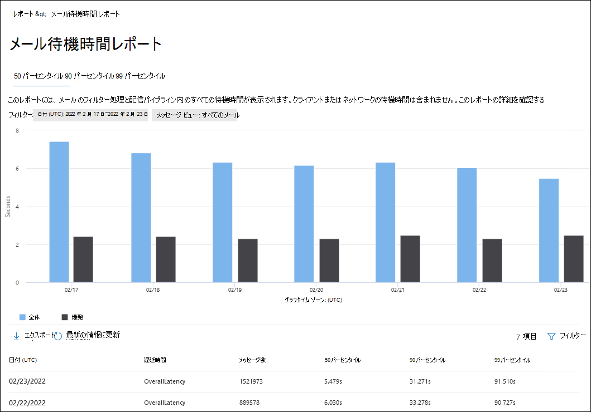
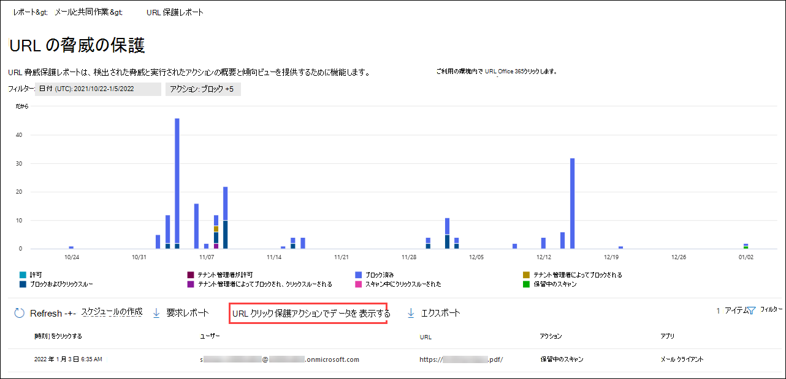
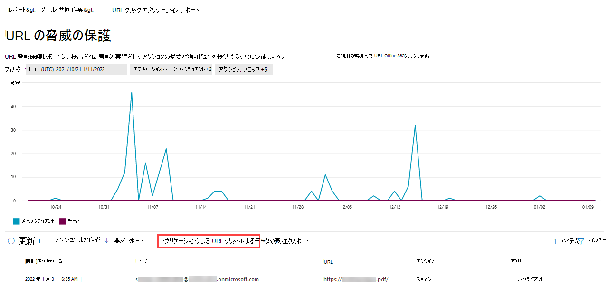

# ポータルでレポートOffice 365 Defender をMicrosoft 365 Defenderする

[!INCLUDE [Microsoft 365 Defender rebranding](../includes/microsoft-defender-for-office.md)]

**適用対象**
- [Microsoft Defender for Office 365 プラン 1 およびプラン 2](defender-for-office-365.md)
- [Microsoft 365 Defender](../defender/microsoft-365-defender.md)

Office 365 組織向け Microsoft Defender (Microsoft 365 E5 サブスクリプション、Office 365 プラン 1 の Microsoft Defender、Office 365 プラン 2 アドオンの Microsoft Defender など) には、さまざまなセキュリティ関連レポートが含まれる。 必要なアクセス許可[を持っている場合](#what-permissions-are-needed-to-view-the-defender-for-office-365-reports)は、これらのレポートを表示し、このポータルでMicrosoft 365 Defenderできます。

## レポートを表示してダウンロードする

### レポートの表示

1. [レポート] \> **[電子メール** \> **&] [グループ&] に移動します**。 [コラボレーション レポートの電子メール] **ページ&移動するには、** を開きます <https://security.microsoft.com/emailandcollabreport> 。

1. 表示するレポートを選択し、[詳細の表示] **を選択します**。  

### レポートのダウンロード

1. ポータルで、[Microsoft 365 Defender]**に移動します。[** レポート  >  **の電子メール] &に移動します**。

2. [ダウンロード **するレポート] を選択します**。

![[&] ポータルの [コラボレーション レポート] ページにMicrosoft 365 Defenderメールを送信します。](/microsoft-365/media/email-collaboration-reports.png)

> [!NOTE]
>
> Defender を必要としない電子メール セキュリティ レポートについては、「Office 365 ポータルの電子メール セキュリティ レポートの表示」[でMicrosoft 365 Defenderされています](view-email-security-reports.md)。
>
> メール フローに関連するレポートは、現在、Exchangeセンター (EAC) に表示されます。 これらのレポートの詳細については、「新しい管理センターのメール フロー レポート[Exchange参照してください](/exchange/monitoring/mail-flow-reports/mail-flow-reports)。

## セーフ添付ファイルの種類レポート

> [!NOTE]
> [**添付セーフファイルの種類] レポートは**、最終的に削除されます。 脅威保護の状態レポートでも同 [じ情報を使用できます](#threat-protection-status-report)。

## セーフ添付ファイル メッセージの廃棄レポート

> [!NOTE]
> 添付 **セーフメッセージ廃棄レポートは**、最終的に消え去ります。 脅威保護の状態レポートでも同 [じ情報を使用できます](#threat-protection-status-report)。

## メール遅延レポート

[ **メール待機時間] レポートには** 、組織内で発生したメール配信とデトレーションの待機時間の集計ビューが表示されます。 サービス内のメール配信時間は、多くの要因によって影響を受け、絶対配信時間 (秒) は成功または問題を示す良い指標ではない場合が多いです。 ある日の配信時間が遅い場合は、別の日の平均配信時間、またはその逆と見なされる場合があります。 これにより、他のメッセージの観測配信時間に関する統計データに基づいて、メッセージ配信を修飾します。

クライアント側とネットワークの待機時間は含まれません。

レポートを表示するには、Microsoft 365 Defender ポータル [を開き、レポートの電子メール] & \> **グループ**& \> **に移動します**。 [電子メール **&コラボレーション レポート] ページ** で、[ **メール遅延レポート** ] を探し、[詳細の表示] **をクリックします**。 レポートに直接移動するには、を開きます <https://security.microsoft.com/mailLatencyReport> 。

![[メール の遅延レポート] ウィジェットが [メール &] ページに表示されます。](../../media/mail-latency-report-widget.png)

[メール **の待機時間レポート] ページで** 、[メールの待機時間] レポート ページで次 **のタブを使用** できます。

- **50 パーセント :** これは、メッセージの配信時間の中央です。 この値は、平均配信時間と見なされます。 このタブは既定で選択されています。
- **90 パーセント :** これは、メッセージ配信の待機時間が長いを示します。 配信にこの値を超える時間がかかったメッセージはわずか 10% です。
- **99 パーセント :** メッセージ配信の最大待機時間を示します。

選択したタブに関係なく、グラフには次のカテゴリに分類されたメッセージが表示されます。

- **メール配信の待機時間**
- **Detonations**

グラフのカテゴリにカーソルを合わせると、各カテゴリの待機時間の内訳を確認できます。

[フィルター] **をクリック** すると、グラフと詳細テーブルの両方を次の値でフィルター処理できます。

- **日付 (UTC)**:**開始日と****終了日**
- **メッセージ ビュー**: 次のいずれかの値。
  - **すべてのメッセージ**
  - **添付ファイルまたは URL を含むメッセージ**
  - **削除されたメッセージ**

フィルターの構成が完了したら、[適用]、[**キャンセル**]、または [フィルターのクリア]**をクリックします**。

グラフの下の詳細テーブルでは、次の情報を使用できます。

- **日付 (UTC)**
- **パーセント :** **50** **、90、****または 99**
- **メッセージ数**
- **全体的な待機時間**

## 脅威保護の状態レポート

脅威 **保護の状態** レポートは [、Exchange Online Protection](exchange-online-protection-overview.md) (EOP) と Microsoft Defender for Office 365 によって検出およびブロックされた悪意のあるコンテンツと悪意のある電子メールに関する情報をまとめる単一のビューです。 詳細については、「脅威保護の [状態レポート」を参照してください](view-email-security-reports.md#threat-protection-status-report)。

## URL 脅威保護レポート

**URL 脅威保護レポートには、** 検出された脅威の概要と傾向ビュー、および URL クリックに対するアクションが[リンク] リンクの一部としてセーフ [されます](safe-links.md)。 このレポートには、[リンク] ポリシーが適用されているユーザーセーフクリックデータが含まれる場合は、[ユーザーのクリックを追跡しない]**オプションが** 選択されています。

レポートを表示するには、Microsoft 365 Defender ポータル [を開き、レポートの電子メール] & \> **グループ**& \> **に移動します**。 [コラボレーション **レポートのメール&] ページ** で **、[URL 保護] ページ** を探し、[詳細の表示] **をクリックします**。 レポートに直接移動するには、を開きます <https://security.microsoft.com/reports/URLProtectionActionReport> 。

![[コラボレーション レポートの電子メール] ページ& URL 保護レポート ウィジェット。](../../media/url-protection-report-widget.png)

[URL 脅威保護レポート] **ページで** 使用可能なビューについては、次のセクションで説明します。

> [!NOTE]
> これは保護傾向 *レポートで、* データは大きなデータセットの傾向を表します。 その結果、グラフ内のデータはリアルタイムでは使用できませんが、詳細テーブルのデータは次の値なので、2 つのデータの間に若干の不一致が見られます。 グラフは 4 時間に 1 回更新され、過去 90 日間のデータが含まれています。

### URL クリック保護アクションによるデータの表示

[URL **によるデータの表示] クリック保護アクション** ビューには、組織内のユーザーによる URL クリックの数と、クリックの結果が表示されます。

- **許可 :** ユーザーは URL に移動できます。
- **ブロック :** ユーザーが URL への移動をブロックされました。
- **ブロックおよびクリックスルー**: ユーザーが URL への移動を続行する選択をしました。
- **スキャン中にクリックスルー**: スキャンが完了する前に、ユーザーがリンクをクリックしました。

クリックすると、ユーザーがブロック ページをクリックして悪意のある Web サイトに移動した (管理者は、[リンク] ポリシーでクリックセーフ無効にできます)。

[フィルター] **をクリック** すると、表示されるフライアウトで次の値の 1 つ以上を選択して、レポートと詳細テーブルを変更できます。

- **日付 (UTC)**:**開始日と****終了日**
- **検出**:
  - **可**
  - **ブロック済み**
  - **ブロックおよびクリックスルー**
  - **スキャン中にクリックスルー**
- **Domains**: レポートの結果に表示される URL ドメイン。
- **受信者**

フィルターの構成が完了したら、[適用]、[**キャンセル**]、または [フィルターのクリア]**をクリックします**。

グラフの下の詳細テーブルには、過去 7 日間に組織内で発生したすべてのクリックのほぼリアルタイム ビューが示されています。

- **クリック時間**
- **ユーザー**
- **URL**
- **操作**
- **アプリ**

### アプリケーション別の URL クリックによるデータの表示

[URL **によるデータの表示] アプリケーション** によるクリックビューには、リンクをサポートするアプリによる URL クリック数セーフ表示されます。

- **電子メール クライアント**
- **PowerPoint**
- **Word**
- **Excel**
- **OneNote**
- **Visio**
- **Teams**
- **Others**

[フィルター] **をクリック** すると、表示されるフライアウトで次の値の 1 つ以上を選択して、レポートと詳細テーブルを変更できます。

- **日付 (UTC)**:**開始日と****終了日**
- **検出**: グラフから使用可能なアプリ。
- **Domains**: レポートの結果に表示される URL ドメイン。
- **受信者**

フィルターの構成が完了したら、[適用]、[**キャンセル**]、または [フィルターのクリア]**をクリックします**。

グラフの下の詳細テーブルには、過去 7 日間に組織内で発生したすべてのクリックのほぼリアルタイム ビューが示されています。

- **クリック時間**
- **ユーザー**
- **URL**
- **操作**
- **アプリ**

## 表示するその他のレポート

この記事で説明するレポートに加えて、次の表で説明するように、いくつかの他のレポートを使用できます。

 

****

|レポート|トピック|
|---|---|
|**エクスプローラー** (Microsoft Defender for Office 365 プラン 2) またはリアルタイム検出 **(Microsoft** Defender for Office 365 プラン 1)|[脅威エクスプローラー (およびリアルタイムの検出)](threat-explorer.md)|
|Defender を必要としない電子メール セキュリティ Office 365|[電子メール セキュリティ レポートを Microsoft 365 Defenderする](view-email-security-reports.md)|
|管理センター (EAC) Exchangeフロー レポート|[新しい管理センターのメール フロー Exchangeレポート](/exchange/monitoring/mail-flow-reports/mail-flow-reports)|
|

PowerShell レポートコマンドレット:

 

****

|レポート|トピック|
|---|---|
|上位送信者および受信者|[Get-MailTrafficTopReport](/powershell/module/exchange/get-mailtraffictopreport) 
 [Get-MailTrafficSummaryReport](/powershell/module/exchange/get-mailtrafficsummaryreport)|
|トップ マルウェア|[Get-MailTrafficSummaryReport](/powershell/module/exchange/get-mailtrafficsummaryreport)|
|メール トラフィック|[Get-MailTrafficATPReport](/powershell/module/exchange/get-mailtrafficatpreport) 
 [Get-MailDetailATPReport](/powershell/module/exchange/get-maildetailatpreport)|
|安全なリンク|[Get-SafeLinksAggregateReport](/powershell/module/exchange/get-safelinksaggregatereport) 
 [Get-SafeLinksDetailReport](/powershell/module/exchange/get-safelinksdetailreport)|
|侵害されたユーザー|[Get-CompromisedUserAggregateReport](/powershell/module/exchange/get-compromiseduseraggregatereport) 
 [Get-CompromisedUserDetailReport](/powershell/module/exchange/get-compromiseduserdetailreport)|
|メール フローの状態|[Get-MailflowStatusReport](/powershell/module/exchange/get-mailflowstatusreport)|
|

## レポートの Defender を表示するために必要なアクセス許可Office 365ですか?

この記事で説明するレポートを表示して使用するには、ポータルで次のいずれかの役割グループのメンバー Microsoft 365 Defenderがあります。

- **組織の管理**
- **セキュリティ管理者**
- **セキュリティ閲覧者**
- **グローバル閲覧者**

詳細については、「[Microsoft 365 Defender ポータルのアクセス許可](permissions-microsoft-365-security-center.md)」を参照してください。

**注**: Microsoft 365 管理センター の対応する Azure Active Directory ロールにユーザーを追加すると、Microsoft 365 Defender ポータルで必要なアクセス許可と、Microsoft 365 の他の機能に対するアクセス許可がユーザーに付与されます。 詳細については、「[管理者の役割について](../../admin/add-users/about-admin-roles.md)」を参照してください。

## レポートにデータが表示されない場合は、

レポートのデータが Defender に表示されない場合Office 365ポリシーが正しく設定されていることを確認してください。 Defender for セーフ[保護](set-up-safe-links-policies.md)を有効セーフするために、組織にリンク ポリシーと添付ファイル Office 365が定義されている必要があります。 「スパム [対策とマルウェア対策の保護」も参照してください](anti-spam-and-anti-malware-protection.md)。

## 関連項目

[スマート レポートと分析情報 (Microsoft 365 Defenderポータル)](reports-and-insights-in-security-and-compliance.md)

[Azure AD組み込みロール](/azure/active-directory/roles/permissions-reference)
