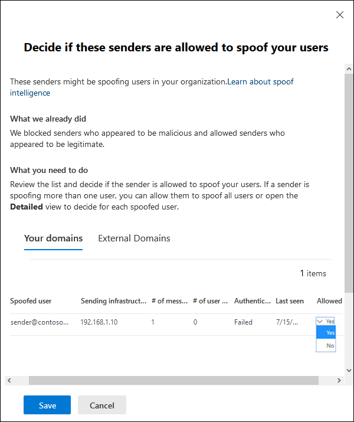

# <a name="manage-spoofed-senders-using-the-spoof-intelligence-policy-and-spoof-intelligence-insight-in-eop"></a>EOP でスプーフィング インテリジェンス ポリシーとスプーフィング インテリジェンスインサイトを使用してスプーフィングされた送信者を管理する

[!INCLUDE [Microsoft 365 Defender rebranding](../includes/microsoft-defender-for-office.md)]

**適用対象**
- [Microsoft Defender for Office 365 プラン 1 およびプラン 2](defender-for-office-365.md)
- [Microsoft 365 Defender](../defender/microsoft-365-defender.md)

> [!IMPORTANT]
> この記事では、置き換えられる以前のスプーフィングされた送信者管理エクスペリエンス(スパム対策ポリシー ページのスプーフィング インテリジェンス ポリシー) について **説明** します。 新しいエクスペリエンス ([テナントの許可/ブロック] リストの [スプーフィング] タブ) の詳細については、「EOP のスプーフィング インテリジェンス[インサイト」を参照してください](learn-about-spoof-intelligence.md)。

Microsoft 365 Exchange Online またはスタンドアロン Exchange Online Protection (EOP) 組織に Exchange Online メールボックスがない組織では、受信電子メール メッセージは 2018 年 10 月現在、EOP によるスプーフィングから自動的に保護されます。 EOP は、 **フィッシングに** 対する組織の全体的な防御の一環としてスプーフィング インテリジェンスを使用します。 詳細については、「EOP でのスプーフィング防止 [保護」を参照してください](anti-spoofing-protection.md)。

既定のスプーフィングインテリジェンス ポリシーを使用すると、正当な送信者から送信されたスプーフィングされたメールが EOP スパム フィルターに巻き込まれたり、スパムやフィッシング攻撃からユーザーを保護したりするのに役立ちます。 スプーフィングインテリジェンスインサイトを使用して、認証されていない電子メール (SPF、DKIM、または DMARC チェックに合格しないドメインからのメッセージ) を正当に送信している外部送信者をすばやく特定することもできます。

スプーフィング インテリジェンスは、Microsoft 365 Defender ポータルまたは PowerShell (Exchange Online のメールボックスを持つ Microsoft 365 組織の Exchange Online PowerShell、Exchange Online メールボックスのない組織のスタンドアロン EOP PowerShell) で管理できます。

## <a name="what-do-you-need-to-know-before-you-begin"></a>はじめに把握しておくべき情報

- <https://security.microsoft.com> で Microsoft 365 Defender ポータルを開きます。
  - **[スパム対策ポリシー]** ページに直接移動するには、<https://security.microsoft.com/antispam> を使用します。

- Exchange Online PowerShell へ接続するには、「[Exchange Online PowerShell に接続する](/powershell/exchange/connect-to-exchange-online-powershell)」を参照してください。 スタンドアロンの EOP PowerShell に接続するには、「[Exchange Online Protection PowerShell への接続](/powershell/exchange/connect-to-exchange-online-protection-powershell)」を参照してください。

- この記事の手順を実行する際には、あらかじめ **Exchange Online** でアクセス許可を割り当てる必要があります。
  - スプーフィング インテリジェンス ポリシーを変更したり、スプーフィング インテリジェンスを有効または無効にするには、組織の管理またはセキュリティ管理者の役割グループのメンバー **である** 必要があります。
  - スプーフィング インテリジェンス ポリシーへの読み取り専用アクセスでは、グローバルリーダーまたはセキュリティ リーダーの役割グループのメンバー **である** 必要があります。

  詳細については、「[Exchange Online のアクセス許可](/exchange/permissions-exo/permissions-exo)」を参照してください。

  **注**:

  - Microsoft 365 管理センターで、対応する Azure Active Directory の役割にユーザーを追加すると、ユーザーには、必要なアクセス許可 _および_ Microsoft 365 のその他の機能に必要なアクセス許可が付与されます。 詳細については、「[管理者の役割について](../../admin/add-users/about-admin-roles.md)」を参照してください。
  - [Exchange Online](/Exchange/permissions-exo/permissions-exo#role-groups) の **閲覧専用の組織管理** の役割グループが この機能への読み取り専用アクセス権も付与します。

- スプーフィング インテリジェンスのオプションについては、「フィッシング対策ポリシー [のスプーフィング設定」を参照してください](set-up-anti-phishing-policies.md#spoof-settings)。

- フィッシング対策ポリシーでスプーフィング インテリジェンス設定を有効、無効、および構成できます。 サブスクリプションに基づく手順については、次のいずれかのトピックを参照してください。

  - [EOP でフィッシング対策ポリシーを構成します](configure-anti-phishing-policies-eop.md)。
  - [Microsoft Defender でフィッシング対策ポリシーを構成して](configure-mdo-anti-phishing-policies.md)、Office 365。

- スプーフィング インテリジェンスの推奨設定については [、「EOP フィッシング対策ポリシー設定」を参照してください](recommended-settings-for-eop-and-office365.md#eop-anti-phishing-policy-settings)。

## <a name="manage-spoofed-senders"></a>スプーフィングされた送信者を管理する

スプーフィングされた送信者を許可およびブロックするには、次の 2 つの方法があります。

- [スプーフィング インテリジェンス ポリシーの使用](#manage-spoofed-senders-in-the-spoof-intelligence-policy)
- [スプーフィング インテリジェンスの分析情報を使用する](#manage-spoofed-senders-in-the-spoof-intelligence-insight)

### <a name="manage-spoofed-senders-in-the-spoof-intelligence-policy"></a>スプーフィング インテリジェンス ポリシーでスプーフィングされた送信者を管理する

> [!IMPORTANT]
> この記事では、置き換えられる以前のスプーフィングされた送信者管理エクスペリエンス(スパム対策ポリシー ページのスプーフィング インテリジェンス ポリシー) について **説明** します。 新しいエクスペリエンス ([テナントの許可/ブロック] リストの [スプーフィング] タブ) の詳細については、「EOP のスプーフィング インテリジェンス[インサイト」を参照してください](learn-about-spoof-intelligence.md)。

1. Microsoft 365 Defender ポータルで、**[ポリシー]** セクションの **[メールと共同作業]** \>**[ポリシーとルール]** \> **[脅威ポリシー]** \> **[スパム対策]** に移動します。

2. [スパム **対策ポリシー] ページで** 、名前をクリックして **[** スプーフィング インテリジェンス ポリシー] を選択します。

   

3. 表示される **スプーフィング インテリジェンス ポリシー** のフライアウトで、次のいずれかの選択を行います。
   - **既に確認した送信者を表示する**
   - **新しい送信者を確認する**

4. [表示 **されるユーザーのスプー** フィングを許可する送信者を決定する] フライアウトで、次のいずれかのタブを選択します。
   - **[ドメイン]:** 内部ドメイン内のユーザーをスプーフィングする送信者。
   - **外部ドメイン**: 外部ドメイン内のユーザーをスプーフィングする送信者。

5. [展開 ![ ] アイコンをクリックします。](../../media/scc-expand-icon.png) をクリック **し** 、次のいずれかの選択を行います。
   - **は** い : スプーフィングされた送信者を許可します。
   - **いいえ**: メッセージをスプーフィングとしてマークします。 このアクションは、既定のフィッシング対策ポリシーまたはカスタムのフィッシング対策ポリシーによって制御されます。 詳細については、「[フィッシング詐欺対策ポリシーでのなりすまし設定](set-up-anti-phishing-policies.md#spoof-settings)」を参照してください。

   

   表示される列と値については、次の一覧で説明します。

   - **スプーフィング** されたユーザー: スプーフィングされているユーザー アカウント。 これは、メール クライアントに表示される差出人アドレス (アドレスとも呼ばれる) のメッセージ `5322.From` 送信者です。 このアドレスの有効性は SPF によってチェックされません。
     - [ドメイン **] タブ** で、値に 1 つの電子メール アドレスが含まれているか、送信元メール サーバーが複数のユーザー アカウントをスプーフィングしている場合は、複数のユーザー アカウントが **含まれる。**
     - [外部 **ドメイン] タブ** の値には、完全なメール アドレスではなく、スプーフィングされたユーザーのドメインが含まれる。

   - **送信インフラストラクチャ**: 送信元電子メール サーバーの IP アドレスの逆引き DNS 参照 (PTR レコード) で見つかったドメイン。 送信元 IP アドレスに PTR レコードがない場合、送信インフラストラクチャは \<source IP\> /24 として識別されます (たとえば、192.168.100.100/24 など)。

     メッセージ ソースとメッセージ送信者の詳細については、「電子メール メッセージ標準の概要 [」を参照してください](how-office-365-validates-the-from-address.md#an-overview-of-email-message-standards)。

   - **メッセージ数**: 過去 30 日以内に、指定されたスプーフィングされた送信者または送信者を含む、送信側インフラストラクチャから組織へのメッセージの数。

   - **ユーザーからの苦情の** 数 : 過去 30 日以内にこの送信者に対してユーザーが申し立てした苦情。 苦情は通常、Microsoft への迷惑メール申請の形式です。

   - **認証結果**: 次のいずれかの値を指定します。
      - **合格**: 送信者が送信者の電子メール認証チェック (SPF または DKIM) を渡しました。
      - **Failed**: 送信者が EOP 送信者認証のチェックに失敗しました。
      - **不明**: これらのチェックの結果は不明です。

   - **最後に** 表示される : スプーフィングされたユーザーを含む送信インフラストラクチャからメッセージを受信した最後の日付。

   - **スプーフィングを許可しますか。**: ここに表示される値は次のとおりです。
     - **は** い : スプーフィングされたユーザーと送信インフラストラクチャの組み合わせからのメッセージは許可され、スプーフィングされた電子メールとして扱われるのではありません。
     - **いいえ**: スプーフィングされたユーザーと送信インフラストラクチャの組み合わせからのメッセージは、スプーフィングとしてマークされます。 アクションは、既定のフィッシング対策ポリシーまたはカスタムのフィッシング対策ポリシーによって制御されます (既定値は [メッセージを迷惑メール フォルダーに移動する] **です**)。 詳細については、次のセクションを参照してください。

     - **一部** のユーザー (**[ドメイン** ] タブのみ): 送信インフラストラクチャは複数のユーザーをスプーフィングしています。スプーフィングされたユーザーの中には許可されているユーザーと許可されていないユーザーがあります。 [詳細] **タブを使用** して、特定のアドレスを表示します。

6. 完了したら、**[保存]** をクリックします。

#### <a name="use-powershell-to-manage-spoofed-senders"></a>PowerShell を使用してスプーフィングされた送信者を管理する

> [!IMPORTANT]
> この記事では、置き換えられる以前のスプーフィングされた送信者管理エクスペリエンス(スパム対策ポリシー ページのスプーフィング インテリジェンス ポリシー) について **説明** します。 新しいエクスペリエンス ([テナントの許可/ブロック] リストの [スプーフィング] タブ) の詳細については、「EOP のスプーフィング インテリジェンス[インサイト」を参照してください](learn-about-spoof-intelligence.md)。

スプーフィング インテリジェンスで許可送信者とブロック送信者を表示するには、次の構文を使用します。

```powershell
Get-PhishFilterPolicy [-AllowedToSpoof <Yes | No | Partial>] [-ConfidenceLevel <Low | High>] [-DecisionBy <Admin | SpoofProtection>] [-Detailed] [-SpoofType <Internal | External>]
```

この例では、ドメイン内のユーザーをスプーフィングできるすべての送信者に関する詳細情報を返します。

```powershell
Get-PhishFilterPolicy -AllowedToSpoof Yes -Detailed -SpoofType Internal
```

構文とパラメーターの詳細については [、「Get-PhishFilterPolicy」を参照してください](/powershell/module/exchange/get-phishfilterpolicy)。

スプーフィング インテリジェンスで許可送信者とブロック送信者を構成するには、次の手順を実行します。

1. 次のコマンドを実行して **、Get-PhishFilterPolicy** コマンドレットの出力を CSV ファイルに書き込み、検出されたスプーフィングされた送信者の現在のリストをキャプチャします。

   ```powershell
   Get-PhishFilterPolicy -Detailed | Export-CSV "C:\My Documents\Spoofed Senders.csv"
   ```

2. CSV ファイルを編集して、次の値を追加または変更します。
   - **送信者** (ソース サーバーの PTR レコードまたは IP/24 アドレスのドメイン)
   - **スプーフィングユーザー**: 次のいずれかの値を指定します。
     - 内部ユーザーの電子メール アドレス。
     - 外部ユーザーのメール ドメイン。
     - スプーフィングされた電子メール アドレスに関係なく、指定された **送信者** からのスプーフィングされたメッセージをブロックまたは許可する場合を示す空白の値。
   - **AllowedToSpoof** (Yes または No)
   - **スプーフィングの** 種類 (内部または外部)

   ファイルを保存し、ファイルを読み取り、次のコマンドを実行して名前を付けられた変数 `$UpdateSpoofedSenders` として格納します。

   ```powershell
   $UpdateSpoofedSenders = Get-Content -Raw "C:\My Documents\Spoofed Senders.csv"
   ```

3. 変数を `$UpdateSpoofedSenders` 使用して、次のコマンドを実行してスプーフィング インテリジェンス ポリシーを構成します。

   ```powershell
   Set-PhishFilterPolicy -Identity Default -SpoofAllowBlockList $UpdateSpoofedSenders
   ```

構文とパラメーターの詳細については [、「Set-PhishFilterPolicy」を参照してください](/powershell/module/exchange/set-phishfilterpolicy)。

### <a name="manage-spoofed-senders-in-the-spoof-intelligence-insight"></a>スプーフィング インテリジェンスインサイトでスプーフィングされた送信者を管理する

> [!IMPORTANT]
> この記事では、置き換えられる以前のスプーフィングされた送信者管理エクスペリエンス(スパム対策ポリシー ページのスプーフィング インテリジェンス ポリシー) について **説明** します。 新しいエクスペリエンス ([テナントの許可/ブロック] リストの [スプーフィング] タブ) の詳細については、「EOP のスプーフィング インテリジェンス[インサイト」を参照してください](learn-about-spoof-intelligence.md)。

1. セキュリティ コンプライアンス センターで&管理ダッシュボード **に移動** \> **します**。

2. [次の **インサイト** で、次のいずれかの項目を探します。

   - **過去 7 日間に** スプーフィングされたドメインの可能性が高い : この分析情報は、スプーフィング インテリジェンスが有効になっている (既定で有効になっている) かどうかを示します。
   - **スプーフィング保護** を有効にする: この分析情報は、スプーフィング インテリジェンスが無効になっていると示し、その分析情報をクリックするとスプーフィング インテリジェンスを有効にすることができます。

3. ダッシュボードの分析情報には、次のような情報が表示されます。

   

   この分析情報には、次の 2 つのモードがあります。

   - **インサイト モード**: スプーフィング インテリジェンスが有効になっている場合、過去 7 日間にスプーフィング インテリジェンス機能によって影響を受けるメッセージの数がインサイトに表示されます。
   - **If モード**: スプーフィング インテリジェンスが無効になっている場合、この分析情報は、過去 7 日間にスプーフィング インテリジェンス機能によって影響を受けるメッセージの数を示します。

   いずれの場合も、インサイトに表示されるスプーフィングされたドメインは、疑わしいドメインと疑わしいドメイン以外の 2 つのカテゴリ **に分けられます**。

   - **疑わしいドメイン**:
     - **高** 信頼スプーフィング : ドメインの過去の送信パターンと評判スコアに基づいて、ドメインがスプーフィングを行い、これらのドメインからのメッセージが悪意のある可能性が高いという確信が強いです。
     - **中程度** の信頼度のスプーフィング: 過去の送信パターンとドメインの評判スコアに基づいて、ドメインがスプーフィングを行い、これらのドメインから送信されるメッセージが正当であると適度に確信しています。 誤検知は、高信頼スプーフィングよりもこのカテゴリに含まれる可能性が高いです。
   - **疑わしいドメイン以外**: ドメインで明示的な電子メール認証が [失敗し、SPF、DKIM、](how-office-365-uses-spf-to-prevent-spoofing.md)および DMARC が [チェックされます](use-dmarc-to-validate-email.md)。 [](use-dkim-to-validate-outbound-email.md) ただし、ドメインは暗黙的な電子メール認証チェック (複合認証)[に合格しました](email-validation-and-authentication.md#composite-authentication)。 その結果、メッセージに対してスプーフィング対策アクションは実行されません。

#### <a name="view-detailed-information-about-suspicious-and-nonsuspicious-domains"></a>疑わしいドメインと非疑わしいドメインに関する詳細情報を表示する

1. スプーフィング インテリジェンスの分析情報で、[疑 **わしい** ドメイン] または [不審でないドメイン] をクリックして、[スプーフィング インテリジェンスの分析情報]**ページに移動** します。 ス **プーフィング インテリジェンスの分析** 情報ページには、次の情報が含まれます。

   - **スプーフィング** されたドメイン: メール クライアントの [From] ボックスに表示されるスプーフィング **された** ユーザーのドメイン。 このアドレスは、アドレスとも呼 `5322.From` ばれる。
   - **インフラストラクチャ**: 送信インフラストラクチャ _とも呼ばれる_。 送信元電子メール サーバーの IP アドレスの逆引き DNS 参照 (PTR レコード) で見つかったドメイン。 送信元 IP アドレスに PTR レコードがない場合、送信インフラストラクチャは \<source IP\> /24 として識別されます (たとえば、192.168.100.100/24 など)。
   - **メッセージ数**: 過去 7 日以内に、指定されたスプーフィングされたドメインを含む送信インフラストラクチャから組織へのメッセージの数。
   - **最後に** 表示される : スプーフィングされたドメインを含む送信インフラストラクチャからメッセージを受信した最後の日付。
   - **スプーフィングの** 種類 : この値は **外部です**。
   - **スプーフィングを許可しますか。**: ここに表示される値は次のとおりです。
     - **は** い : スプーフィングされたユーザーのドメインと送信インフラストラクチャの組み合わせからのメッセージは許可され、スプーフィングされた電子メールとして扱われるのではありません。
     - **いいえ**: スプーフィングされたユーザーのドメインと送信インフラストラクチャの組み合わせからのメッセージは、スプーフィングとしてマークされます。 アクションは、既定のフィッシング対策ポリシーまたはカスタムのフィッシング対策ポリシーによって制御されます (既定値は [メッセージを迷惑メール フォルダーに移動する] **です**)。

2. リスト内のアイテムを選択して、フライアウトのドメイン/送信インフラストラクチャ ペアに関する詳細を表示します。 この情報には、次の情報が含まれます。
   - なぜこれをキャッチしたのか。
   - 何をする必要があります。
   - ドメインの概要。
   - 送信者に関する WhoIs データ。
   - テナントで同じ送信者から見た同様のメッセージ。

   ここから、[送信者のスプーフィングを許可する] 一覧からドメイン/送信インフラストラクチャのペアを追加または削除できます。 単にトグルを設定します。

   ![[スプーフィング インテリジェンスの分析情報の詳細] ウィンドウのドメインのスクリーンショット。](../../media/03ad3e6e-2010-4e8e-b92e-accc8bbebb79.png)

## <a name="how-do-you-know-these-procedures-worked"></a>正常な動作を確認する方法

スプーフィングが許可され、スプーフィングが許可されていない送信者とスプーフィング インテリジェンスが構成されていることを確認するには、次の手順を使用します。

- **メール &コラボレーション** \>**ポリシー&ルール** \>**脅威ポリシー** \>**[** ポリシー] セクションの [スプーフィング インテリジェンス ポリシー] で[送信者を表示する] を選択し、[ドメインまたは外部ドメイン] タブを選択し、送信者の [スプーフィングを許可する] 値を \>  \>  \> **確認** します。

- PowerShell で、次のコマンドを実行して、スプーフィングが許可されている送信者とスプーフィングが許可されていない送信者を表示します。

  ```powershell
  Get-PhishFilterPolicy -AllowedToSpoof Yes -SpoofType Internal
  Get-PhishFilterPolicy -AllowedToSpoof No -SpoofType Internal
  Get-PhishFilterPolicy -AllowedToSpoof Yes -SpoofType External
  Get-PhishFilterPolicy -AllowedToSpoof No -SpoofType External
  ```

- PowerShell で、次のコマンドを実行して、すべてのスプーフィングされた送信者の一覧を CSV ファイルにエクスポートします。

   ```powershell
   Get-PhishFilterPolicy -Detailed | Export-CSV "C:\My Documents\Spoofed Senders.csv"
   ```
