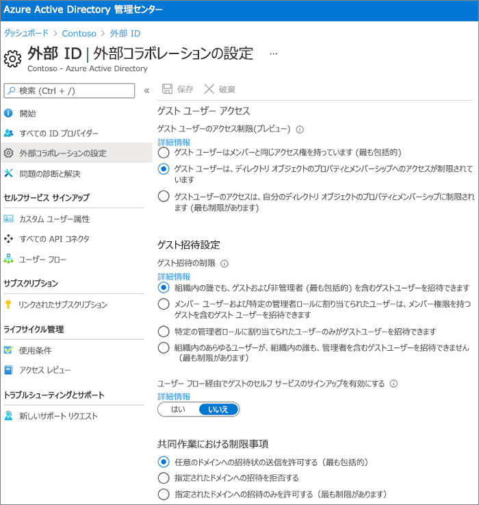
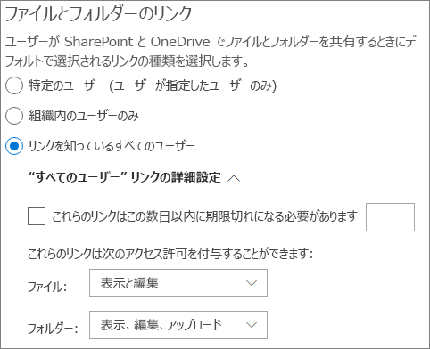

# ゲストと共同でドキュメントの作業をする

SharePoint または OneDrive のドキュメントで組織外のユーザーと共同作業する必要がある場合は、共有リンクをドキュメントに送信できます。 この記事では、組織のニーズに合った SharePoint と OneDrive の共有リンクを設定するために必要な Microsoft 365 構成手順について説明します。

## ビデオ デモンストレーション

このビデオは、このドキュメントで説明されている構成手順を示しています。 

> [!VIDEO https://www.microsoft.com/videoplayer/embed/RE450Vt?autoplay=false]

## Azure の外部コラボレーション設定

Microsoft 365 での共有は、[Azure Active Directory における B2B 外部コラボレーションの設定](/azure/active-directory/external-identities/delegate-invitations) によって最高レベルで管理されます。 ゲスト共有が無効または制限されている場合は、Azure AD で構成した共有設定が上書きMicrosoft 365。

B2B 外部コラボレーション設定を確認して、ゲストとの共有がブロックされないか確認します。

外部コラボレーションを設定するには

1. [https://aad.portal.azure.com](https://aad.portal.azure.com) で Azure Active Directory にログインします。
2. 左側のナビゲーション ウィンドウで **[Azure Active Directory]** をクリックします。
3. **[外部 ID]** をクリックします。
4. **[開始]** 画面で、左側のナビゲーション ウィンドウで **[外部コラボレーション設定]** をクリックします。
5. 特定の管理者ロールに割り当てられたメンバー ユーザーとユーザーが、メンバーアクセス許可を持つゲストを含むゲスト ユーザーを招待できるか、組織内のユーザーがゲストを含むゲスト ユーザーを招待し、管理者以外のユーザーを招待できます。
6. 変更を加えた場合は、**[保存]** をクリックします。

**[共同作業の制限]** セクションの設定に注意してください。 共同作業するゲストのドメインがブロックされていないことを確認します。

複数の組織のゲストと連携する場合は、ディレクトリ データにアクセスするゲストの機能を制限することをお勧めします。 これにより、他に誰がディレクトリ内のゲストであるかを確認できなくなります。 これを行うには、**[ゲスト ユーザーのアクセス制限]** で、**[ゲスト ユーザーはディレクトリ オブジェクト設定のプロパティとメンバーシップに制限付きアクセス権が付与されている]** または **[ゲスト ユーザーのアクセスは自分のディレクトリ オブジェクトのプロパティとメンバーシップに制限されている]** を選択します。

## SharePointレベルの共有設定

組織外のユーザーが SharePoint または OneDrive のドキュメントにアクセスするには、SharePoint と OneDrive の組織レベルの共有設定で組織外のユーザーとの共有を許可する必要があります。

組織レベルの設定は、SharePointサイトで使用できる設定をSharePointします。 サイトの設定は、組織レベルの設定よりも制限を緩和することはできません。 ユーザーの組織レベルの設定OneDrive、ユーザーの共有ライブラリで使用できる共有のOneDriveします。

[SharePointとOneDrive、認証されていないファイルとフォルダーの共有を許可する場合は、[すべてのユーザー] を **選択します**。 組織外のユーザーが認証する必要がある場合は、[新規ゲストと既存のゲスト] **を選択します**。 *誰* でもリンクを共有するのが最も簡単な方法です。組織外のユーザーは、認証なしでリンクを開き、それを他のユーザーに自由に渡します。

たとえばSharePoint、組織内の任意のサイトで必要になる最も制限の多い設定を選択します。

SharePoint 組織レベルの共有設定を設定するには

1. Microsoft 365 管理センターの左側のナビゲーション ウィンドウの **[管理センター]** で、**[SharePoint]** をクリックします。
2. 管理センター SharePoint左側のナビゲーション ウィンドウの [ポリシー] で、[**共有]** を **クリックします**。
3. ユーザーまたはユーザーの外部SharePoint共有OneDrive[すべてのユーザー] または [新しいゲストと既存のゲスト **] に設定します**。 (この設定は、OneDriveの設定よりもSharePoint注意してください。
4. 変更を加えた場合は、**[保存]** をクリックします。

## SharePoint 組織レベルの既定のリンク設定

既定のファイルとフォルダーのリンク設定により、ファイルまたはフォルダーを共有するときに既定でユーザーに表示されるリンク オプションが決まります。 ユーザーは、必要に応じて、共有する前に他のオプションのいずれかにリンクの種類を変更できます。

この設定は、組織SharePointサイトに影響を及ぼすOneDrive。

ユーザーがファイルとフォルダーを共有するときに既定で選択される次の種類のリンクを選択します。

- **リンクを持つユーザー** - 認証されていないファイルとフォルダー共有を多く行う場合は、このオプションを選択します。 *全員* リンクを許可したいが、誤って認証されない共有が心配な場合は、他のオプションのいずれかを既定として検討してください。 このリンクの種類は、**全員** 共有を有効にしている場合にのみ使用できます。
- **組織内のユーザーのみ** - ほとんどのファイルとフォルダーの共有が組織内のユーザーと行われることが予想される場合は、このオプションを選択します。
- **特定のユーザー** - ゲストと多くのファイルやフォルダーを共有することが予想される場合は、このオプションを検討してください。 この種類のリンクはゲストと連携し、ゲストに認証を要求します。
 

組織レベルの既定SharePointのOneDriveのリンク設定を設定するには

1. SharePoint 管理センターの共有ページに移動します。
2. **ファイルとフォルダーのリンク** で、使用する既定の共有リンクを選択します。
3. 変更を加えた場合は、**[保存]** をクリックします。

共有リンクのアクセス許可を設定するには、[リンクの共有に既定で選択されているアクセス許可 **を選択する] で選択します。**

1. 認証 **されていないユーザー** がファイルとフォルダーを変更しない場合は、[表示] を選択します。
2. 認証 **されていないユーザー** がファイルとフォルダーに変更を加えるのを許可する場合は、[編集] を選択します。

上記の 2 つの事前入力オプションは、ゲスト/外部ユーザーだけでなく、内部ユーザーにも適用できます。 選択するアクセス許可オプションは、自己判断によって決まります。

誰とでも共有できるリンクのアクセス許可を設定するには

1. [これらの **リンクでは、次のアクセス許可を付与できます。** 
    1. [ファイル **]** ドロップダウン リストから、 
        - 認証 **されていないユーザーが** ファイルに変更を加えるのを許可する場合は、[表示と編集] を選択します。
        - 認証 **されていないユーザー** がファイルを変更しない場合は、[表示] を選択します。
    2. [フォルダー **]** ドロップダウン リストから、
        - 認証 **されていないユーザーが** フォルダーに変更を加えるのを許可する場合は、[表示、編集、アップロード] を選択します。
        - 認証 **されていないユーザー** がフォルダーに変更を加えたくない場合は、[表示] を選択します。

## SharePoint のサイト レベル共有設定のスクリーンショット

SharePoint サイト内のファイルとフォルダーを共有する場合は、そのサイトのサイト レベルの共有設定も確認する必要があります。

サイトレベルの共有設定を設定するには

1. SharePoint 管理センターの左側のナビゲーション ウィンドウで、[**サイト**] を展開して [**アクティブなサイト**] をクリックします。
2. ゲストとファイルやフォルダーを共有するサイトを選択します。
3. 行 (選択したサイトが存在する) を右にスクロールし、[外部共有] 列の任意の **場所をクリック** します。
4. ポップアップするページで、[ポリシー] タブ **をクリック** します。
5. [外部共有 **] ウィンドウで、[** 編集] を **クリックします**。
6. 共有が **[全員]** または **[新規および既存のゲスト]** に設定されていることを確認します。
7. 変更を加えた場合は、**[保存]** をクリックします。

## ユーザーを招待する

ゲスト共有の設定が構成されています。これで、ユーザーは組織外のユーザーとファイルやフォルダーを共有できます。 詳細[については、「OneDriveファイルとフォルダーの共有](https://support.office.com/article/9fcc2f7d-de0c-4cec-93b0-a82024800c07)」および[「SharePointフォルダーの共有」](https://support.office.com/article/1fe37332-0f9a-4719-970e-d2578da4941c)を参照してください。

## 関連項目

[認証されていないユーザーとファイルおよびフォルダーを共有するためのベスト プラクティス](best-practices-anonymous-sharing.md)

[ゲストと共有するときにファイルの偶発的な公開を制限する](share-limit-accidental-exposure.md)

[SharePoint および OneDrive の Azure AD B2B との統合](/sharepoint/sharepoint-azureb2b-integration-preview)
