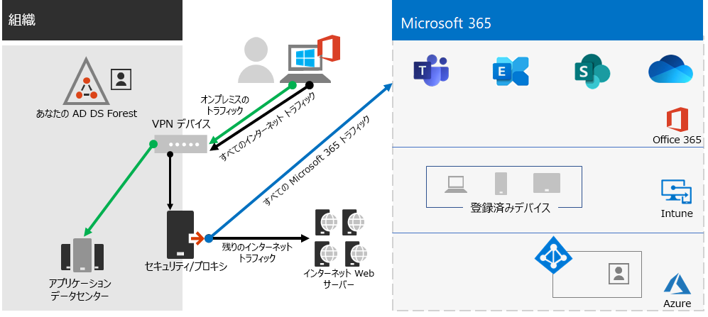
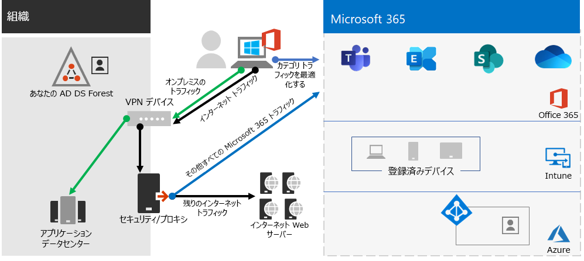
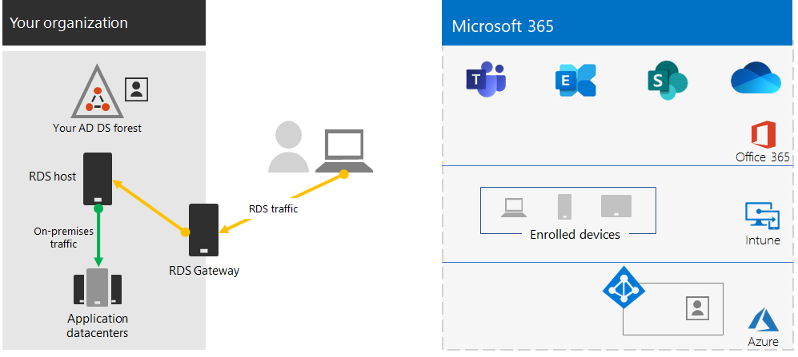

# 手順 2: オンプレミスのアプリとサービスへのリモート アクセスを提供する

組織でリモートアクセス VPN ソリューションを使用している場合 (通常、ネットワークのエッジに VPN サーバー、ユーザーのデバイスにインストールされた VPN クライアントがある場合)、ユーザーはリモートアクセス VPN 接続を使用してオンプレミスのアプリやサーバーにアクセスできます。ただし、Microsoft 365 クラウドベース サービスへのトラフィックを最適化することが必要になる場合があります。

ユーザーが VPN ソリューションを使用していない場合は、すべてのアプリが Web ベースであるかどうかに応じて、Azure Active Directory (Azure AD) アプリケーション プロキシと Azure Point-to-Site (P2S) VPN を使用してアクセスを提供できます。

リモート アクセスのプライマリ構成は次のとおりです。

- 既にリモート アクセス VPN ソリューションを使用しています。
- リモートアクセス VPN ソリューションを使用していない場合、リモートワーカーに個人用コンピューターを使用したい。
- リモート アクセス VPN ソリューションを使用しておらず、ハイブリッド ID があり、オンプレミスの Web ベースのアプリへのリモート アクセスのみが必要です。
- リモート アクセス VPN ソリューションを使用しておらず、オンプレミス アプリへのアクセスが必要であり、その一部は Web ベースではありません。

この記事で説明するリモート アクセス構成オプションについては、このフローチャートを参照してください。

リモート アクセス接続では、[リモート デスクトップ](https://support.microsoft.com/help/4028379/windows-10-how-to-use-remote-desktop)を使用して、ユーザーをオンプレミス PC に接続することもできます。 たとえば、リモート ワーカーはリモート デスクトップを使用して、Windows、iOS、または Android デバイスからオフィスの PC に接続できます。 リモートで接続すると、目の前に座っているかのように使用できます。

## Microsoft 365 クラウド サービスへのリモート アクセス VPN クライアントのパフォーマンスを最適化する

リモート ワーカーが従来の VPN クライアントを使用して組織ネットワークへのリモート アクセスを取得している場合は、VPN クライアントがスプリット トンネリング サポートを備えていることを確認してください。

スプリット トンネリングを使用しない場合、すべてのリモート作業トラフィックは VPN 接続を介して送信され、そこで組織のエッジ デバイスに転送されて処理され、インターネット上で送信される必要があります。

Microsoft 365 トラフィックは、組織を経由して間接的にルーティングする必要があります。これは、VPN クライアントの物理的な場所から遠く離れた Microsoft ネットワーク エントリ ポイントに転送される可能性があります。この間接パスにより、ネットワーク トラフィックが遅延し、全体的なパフォーマンスを低下させます。

スプリッ トトンネリングを使用すると、VPN クライアントを構成して、特定の種類のトラフィックが VPN 接続を介して、組織ネットワークに送信されることを除外できます。

Microsoft 365 クラウドリソースへのアクセスを最適化するには、VPN 接続を介して、**最適化** カテゴリの Microsoft 365 エンドポイントへのトラフィックを除外するようにスプリット トンネリング VPN クライアントを構成します。 詳細については、「[Office 365 エンドポイントのカテゴリ](../enterprise/microsoft-365-network-connectivity-principles.md#new-office-365-endpoint-categories)」をご覧ください。 最適化カテゴリのエンドポイントについては、[こちらのリスト](../enterprise/urls-and-ip-address-ranges.md)をご覧ください。

Microsoft 365 クラウド アプリへのほとんどのトラフィックが VPN 接続をバイパスした結果としてのトラフィック フローは、以下のとおりです。

これにより、VPN クライアントは、インターネット経由で、または Microsoft ネットワークへの最も近いエントリポイントに、重要な Microsoft 365 クラウド サービスのトラッフィックを送受信できます。

詳細とガイダンスについては、「[VPN スプリット トンネリングを使用してリモート ユーザーの Office 365 の接続を最適化する](../enterprise/microsoft-365-vpn-split-tunnel.md)」をご覧ください。

## すべてのアプリが Web アプリであり、ハイブリッド ID がある場合にリモート アクセスを展開する

リモート ワーカーが従来の VPN クライアントを使用しておらず、オンプレミスのユーザー アカウントとグループが Azure AD と同期している場合は、Azure AD アプリケーション プロキシを使用して、オンプレミスのサーバーでホストされている Web ベースのアプリケーションに対して安全なリモート アクセスを提供できます。 Web ベースのアプリケーションには、SharePoint Server サイト、Outlook Web Access サーバー、またはその他の Web ベースの基幹業務アプリケーションが含まれます。

ここでは、Azure AD アプリケーション プロキシのコンポーネントを示します。

詳細については、この「[Azure AD アプリケーション プロキシの概要](/azure/active-directory/manage-apps/application-proxy)」をご覧ください。

> [!NOTE]
> Azure AD アプリケーションプロキシは、Microsoft 365 のサブスクリプションには含まれていません。 別の Azure サブスクリプションで使用する場合は、支払う必要があります。

## すべてのアプリが Web アプリではない場合にリモート アクセスを展開する

リモート ワーカーが従来の VPN クライアントを使用しておらず、お使いのアプリが Web ベースではない場合は、Azure Point-to-Site (P2S) VPN を使用できます。

P2S VPN 接続は、Azure 仮想ネットワークを介してリモート ワーカーのデバイスから組織ネットワークへの安全な接続を作成します。

詳細については、この「[P2S VPN の概要](/azure/vpn-gateway/point-to-site-about)」をご覧ください。

> [!NOTE]
> Azure P2S VPN は、Microsoft 365 のサブスクリプションには含まれていません。 別の Azure サブスクリプションで使用する場合は、支払う必要があります。

## リモート ワーカーが個人用デバイスを使用してリモート アクセスできるように、Windows Virtual Desktop を展開する

個人用デバイスや管理されていないデバイスのみを使用できるリモート ワーカーをサポートするには、Azure の Windows Virtual Desktop を使用して、ユーザーが自宅から使用する仮想デスクトップを作成して割り当てます。仮想化された PC は、組織のネットワークに接続されている PC と同じように動作します。

詳細については、「[Windows Virtual Desktop の概要](/azure/virtual-desktop/overview)」をご覧ください。

> [!NOTE]
>Windows Virtual Desktop は、Microsoft 365 のサブスクリプションには含まれていません。 別の Azure サブスクリプションで使用する場合は、支払う必要があります。

## リモートデスクトップサービスゲートウェイを使用して、リモートデスクトップサービス接続を保護する

リモートデスクトップサービス (RDS) を使用している場合、従業員がオンプレミスのネットワーク上の Windows ベースのコンピューターに接続できるようにするには、エッジネットワークの Microsoft リモートデスクトップサービスゲートウェイを使用する必要があります。 ゲートウェイはトランスポート層セキュリティ (TLS) を使用してトラフィックを暗号化し、RDS をホストしているオンプレミス コンピューターがインターネットに直接公開されるのを防ぎます。

詳細については、[こちらの記事](https://www.microsoft.com/security/blog/2020/04/16/security-guidance-remote-desktop-adoption/)を参照してください。 

## リモート アクセスのための管理技術リソース

- [リモート社員の Office 365 トラフィックをすぐに最適化し、インフラストラクチャの負担を軽減する方法](https://techcommunity.microsoft.com/t5/office-365-blog/how-to-quickly-optimize-office-365-traffic-for-remote-staff-amp/ba-p/1214571)
- [VPN スプリット トンネリングを使用してリモート ユーザーの Office 365 の接続を最適化する](../enterprise/microsoft-365-vpn-split-tunnel.md)

## 手順 2 の結果

リモート アクセス ソリューションをリモート ワーカーに展開した後、次の操作を行います。

| リモート アクセス構成 | 結果 |
|:-------|:-----|
| リモート アクセス VPN ソリューションが導入されている | リモート アクセス VPN クライアントをスプリット トンネリング用と Microsoft 365 エンドポイントの最適化カテゴリ用に構成しました。 |
| リモート アクセス VPN ソリューションはなく、オンプレミスの Web ベースのアプリへのリモート アクセスのみが必要です | Azure アプリケーション プロキシを構成しました。 |
| リモート アクセス VPN ソリューションはなく、オンプレミス アプリへのアクセスが必要であり、その一部は Web ベースではありません | Azure P2S VPN を構成しました。 |
| リモート ワーカーは自宅から個人用デバイスを使用しています | Windows Virtual Desktop を構成しました。 |
| リモートワーカーがオンプレミスシステムへの RDS 接続を使用している | 境界ネットワークにリモートデスクトップサービスゲートウェイを展開しました。 |
|||

## 次の手順

Microsoft 365 のセキュリティとコンプライアンスのサービスを展開して、お客様のアプリケーション、データ、およびデバイスを保護するには [手順 3](empower-people-to-work-remotely-security-compliance.md) に進んでください。