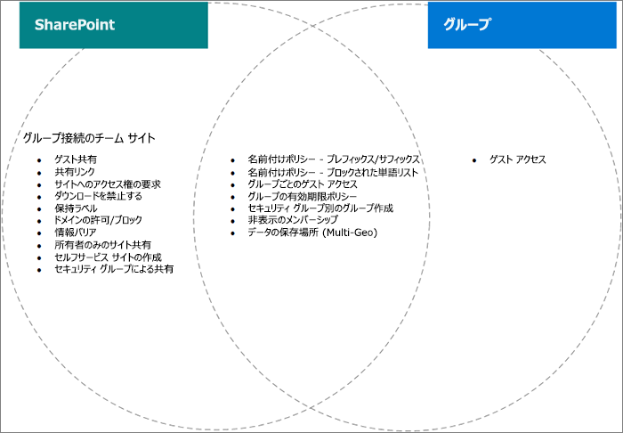

# 設定グループとグループ間Microsoft 365の相互作用SharePoint

Microsoft 365グループとSharePointのMicrosoft 365、特に共有とグループとチーム サイトの作成に関連する設定は、互いに重なっています。 この記事では、これらの設定を操作する方法に関するこれらの操作とベスト プラクティスについて説明します。

## グループに対するSharePoint設定Microsoft 365影響

|SharePoint設定|説明|グループへのMicrosoft 365影響|推奨事項|
|:-----------------|:----------|:-----------------------------|:-------------|
|組織とサイトの外部共有|サイト、ファイル、フォルダーを組織外のユーザーと共有できるかどうかを指定します。|グループSharePoint設定が一致しない場合は、グループ内のゲストがサイトへのアクセスをブロックされる場合や、サイト内で外部アクセスを利用できますが、グループ内でアクセスできない場合があります。|共有設定を変更する場合は、グループ設定とグループSharePointチーム サイトのサイト設定の両方を確認します。  「サイト [内のゲストと共同作業する」を参照してください](./collaborate-in-site.md)。|
|ドメインの許可/ブロック|指定したドメインとコンテンツが共有されるのを許可または防止します。|グループはリストを許可SharePointブロックする機能を認識しない。 グループ内で許可SharePointユーザーは、グループSharePointアクセスできます。|Azure のドメイン許可/ブロック リストを管理し、ADをSharePointします。 ドメインを許可およびブロックする組織全体のガバナンス プロセスを作成します。  「SharePoint[の設定」および](/sharepoint/restricted-domains-sharing)「Azure ドメイン設定[AD」を参照してください。](/azure/active-directory/b2b/allow-deny-list)|
|特定のセキュリティ グループ内のユーザーにのみ、外部との共有を許可する|サイト、フォルダー、およびファイルを外部で共有できるセキュリティ グループを指定します。|この設定は、グループの所有者がグループを外部で共有する場合には影響を与えかねない。 グループ ゲストは、関連付けられたサイトにSharePointできます。||
|SharePoint共有設定|グループ メンバーシップの外部でサイトを直接共有できるユーザーを指定します。 これは、グループまたはサイトの所有者によって構成されます。|この設定はグループに直接影響を与えるものではありませんが、ユーザーがサイトに追加され、他のグループ リソースにアクセスできない場合があります。|この設定を使用して、サイトの共有を直接制限し、グループを通じてサイト アクセスを管理する方法を検討してください。|
|ユーザーがスタート ページからサイトをSharePointし、サイトを作成OneDrive|ユーザーが新しいサイトを作成SharePointします。|この設定をオフにした場合でも、ユーザーはグループを作成することでグループに接続されたチーム サイトを作成できます。||

## グループ設定がMicrosoft 365に及SharePoint

|Microsoft 365グループの設定|説明|データに対するSharePoint|推奨事項|
|:---------------------------|:----------|:-------------------|:-------------|
|名前付けポリシー|グループ名のプレフィックスとサフィックス、およびグループ作成のブロックされた単語を指定します。|ポリシーは、グループに接続されたチーム サイトを作成するユーザーに適用されますが、他のテンプレートとの通信サイトやサイトには適用されません。|必要に応じて、通信サイトの個別の名前付けガイダンスを作成します。|
|グループのゲスト アクセス|組織外のユーザーをグループに追加できる場合に指定します。|グループSharePoint設定が一致しない場合は、グループ内のゲストがサイトへのアクセスをブロックされる場合や、サイト内で外部アクセスを利用できますが、グループ内でアクセスできない場合があります。|共有設定を変更する場合は、グループ設定とグループSharePointチーム サイトのサイト設定の両方を確認します。  「サイト [内のゲストと共同作業する」を参照してください。](./collaborate-in-site.md)|
|セキュリティ グループによるグループ作成|グループを作成できるのは、特定のセキュリティ グループのメンバーのみです。|セキュリティ グループのメンバーではないユーザーは、グループに接続されたチーム サイトを作成できます。|グループを要求するプロセスに、サイトを要求する手順が含まれています。|
|グループの有効期限ポリシー|アクティブに使用されていないグループが自動的に削除される期間を指定します。|グループが削除された場合、関連付SharePointサイトも削除されます。 アイテム保持ポリシーによって保護されたコンテンツは保持されます。|有効期限ポリシーを使用して、未使用のグループとサイトの広がりを回避します。|

## 関連項目

[コラボレーション ガバナンス計画のステップ バイ ステップ](collaboration-governance-overview.md#collaboration-governance-planning-step-by-step)

[コラボレーション ガバナンス 計画の作成](collaboration-governance-first.md)

[組織外部のユーザーとの共有](./collaborate-with-people-outside-your-organization.md)

[SharePoint のサイト作成を管理する](/sharepoint/manage-site-creation)