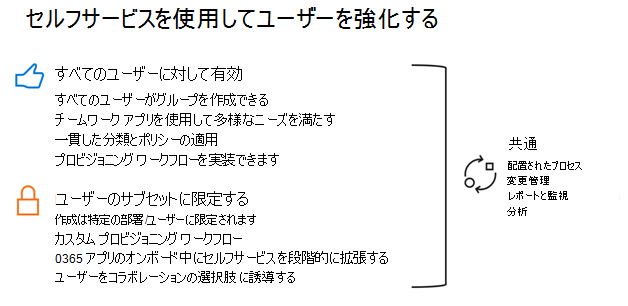

# Microsoft 365 グループとMicrosoft Teamsの組織とライフサイクル ガバナンスを計画する

Microsoft 365 グループには、組織が必要とするガバナンス機能を実装するための豊富なツールセットがあります。 

次のセクションでは、機能について説明し、ベスト プラクティスを推奨し、ガバナンスの要件とそれを満たす方法を決定するための適切な質問をするためのガイダンスを提供します。

## Microsoft 365 グループを作成できるユーザーを制御する

グループは、Outlook、SharePoint、Teams、その他の環境を含む複数のエンドポイントからエンド ユーザーが作成できます。

グループの所有者を強化し、ユーザーがより簡単に作業を完了できるように、セルフサービスを推奨します。 多くのMicrosoft 365 サービスでは、サービスが機能するためにグループを作成する必要があるため、グループとチームの作成を制限すると、ユーザーの生産性が低下する可能性があります。

グループの作成には、次のガバナンス オプションを検討してください。

- グループのスプロールを制限するには、 [グループの有効期限ポリシー](microsoft-365-groups-expiration-policy.md) を使用して、使用されていないグループを自動的に削除します。
- グループの作成を、すべての正社員を含む [動的メンバーシップを持つセキュリティ グループ](/azure/active-directory/users-groups-roles/groups-create-rule) のメンバーに制限します。
- グループの作成をセキュリティ グループに制限し、ユーザーがセキュリティ グループのメンバーになるために組織のグループ使用ポリシーのトレーニングを完了するように要求します。

グループを作成できるユーザーを制限する場合は、これを構成する方法の詳細については、「[Microsoft 365 グループを作成できるユーザーを管理](manage-creation-of-groups.md)する」を参照してください。

## グループの削除、復元、およびアーカイブ

Microsoft 365 グループが削除されると、既定では 30 日間保持されます。 グループを引き続き復元できるため、この 30 日の期間は "論理的な削除" と呼ばれます。 30 日後、グループおよび関連付けられているコンテンツは完全に削除され、復元することはできません。

チャット、ファイル、またはメールを保持するためのアイテム保持ポリシーが設定されている場合、それらのアイテムはグループが削除された後も保持されます。 詳細については、「 [アイテム保持ポリシーの](../compliance/retention.md) 詳細」を参照してください。

グループを削除しても、1 つ以上のグループに接続されたサービスからコンテンツを保持する場合は、「[グループ、チーム、およびYammerをアーカイブ](end-life-cycle-groups-teams-sites-yammer.md)する」を参照してください。

## グループの名前付けポリシー

グループの名前付けポリシーは、次の 2 つの方法でグループを管理するのに役立ちます。

- プレフィックス/サフィックスの名前付けポリシーを使用すると、グループ名とその関連付けられた電子メール アドレスの先頭または末尾に固定文字列またはAzure AD属性を適用できます。 これを行うと、グループ名に部署名やリージョンなどを確実に含めることができます。
- ブロックされた単語ポリシーでは、エグゼクティブの名前などの特定の単語がグループ名で使用されないようにすることができます。

名前付けポリシーは、グループに接続されたサービスからグループが作成されるときに適用されます。

グループに名前付けポリシーを使用する場合は、名前付け[ポリシー Microsoft 365 グループ](groups-naming-policy.md)参照してください。

## グループの有効期限ポリシー

有効期限を指定すると、その期間の終わりに達し、更新されていないグループは削除されます。 有効期限は、グループが作成されたとき、または最後に更新された日付に開始されます。

有効期限が切れるグループを設定すると、次のようになります。
- グループの所有者には、有効期限が近づくにつれてグループを更新するように通知されます。
- アクティブなグループは自動的に更新されます。
- 更新されていないグループはすべて削除されます。
- 削除されたすべてのグループは、グループ所有者または管理者が 30 日以内に復元できます。

有効期限ポリシーは、使用されなくなったグループが確実に削除されるようにすることで、グループのスプロールを制限するのに適した方法です。 グループの有効期限ポリシーを作成する場合は、「[Microsoft 365 グループ有効期限ポリシー](microsoft-365-groups-expiration-policy.md)」を参照してください。

## 関連項目

[おすすめのコラボレーション ガバナンス計画](collaboration-governance-overview.md#collaboration-governance-planning-recommendations)

[コラボレーション ガバナンス計画を作成する](collaboration-governance-first.md)

[元従業員を削除してデータを保護する](/microsoft-365/admin/add-users/remove-former-employee)
