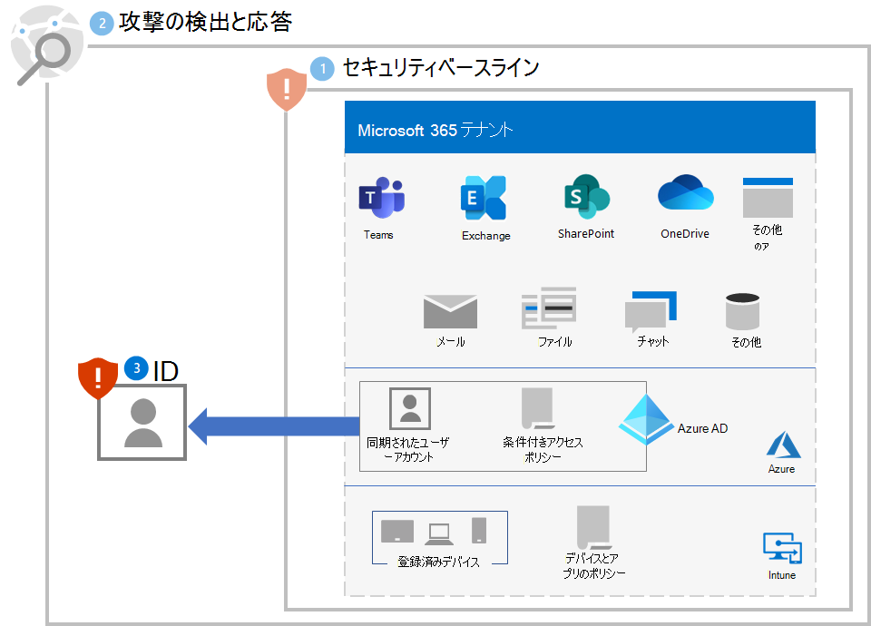

# 手順 3. ID を保護する

次のセクションを使用して、通常、大規模なランサムウェア攻撃の最初の段階である資格情報の侵害から組織を保護します。

## サインイン セキュリティを強化する

Azure Active Directory (Azure AD) のユーザー アカウントに[パスワードなしの認証](/azure/active-directory/authentication/howto-authentication-passwordless-deployment)を使用します。

パスワードなしの認証への移行中は、パスワード認証を引き続き使用するユーザー アカウントに対して次のベスト プラクティスを使用します。

- [Azure AD パスワード保護](/azure/active-directory/authentication/concept-password-ban-bad)を使用して、既知の脆弱なカスタム パスワードをブロックします。
- 既知の脆弱なカスタム パスワードのブロックを [Azure AD パスワード保護を使用したオンプレミスの Active Directory ドメイン サービス (AD DS)](/azure/active-directory/authentication/concept-password-ban-bad-on-premises) に拡張します。
- [セルフサービスによるパスワード リセット (SSPR)](/azure/active-directory/authentication/concept-sspr-howitworks) を使用して、ユーザーが自分のパスワードを変更できるようにします。

次に、[共通 ID およびデバイス アクセス ポリシー](/microsoft-365/security/office-365-security/identity-access-policies)を実装します。 これらのポリシーは、Microsoft 365 クラウド サービスへのアクセスに対してより高いセキュリティを提供します。 

ユーザー サインインの場合、これらのポリシーには次のものが含まれます。

- [優先度アカウント](/microsoft-365/admin/setup/priority-accounts) (直ちに) および最終的にすべてのユーザー アカウントに多要素 認証 (MFA ) を要求する。
- MFA を使用するためにリスクの高いサインインを要求する。
- リスクの高いサインインを持つリスクの高いユーザーにパスワードの変更を要求する。

## 特権エスカレーションを防止する

次のベスト プラクティスを使用します。

- サインインにパスワードを使用しているユーザー アカウントの「[サインイン セキュリティを強化する](#increase-sign-in-security)」で説明されているように、[最小特権](/windows-server/identity/ad-ds/plan/security-best-practices/implementing-least-privilege-administrative-models)の原則を実装し、パスワード保護を使用します。 
- ドメイン全体の管理者レベルのサービス アカウントの使用は避けてください。 
- ローカル管理者特権を制限して、リモート アクセス トロイの木馬(RAT) やその他の不要なアプリケーションのインストールを制限します。
- 管理ポータルへのアクセスを許可する前に、Azure AD 条件付きアクセスを使用して、ユーザーとワークステーションの信頼を明示的に検証します。Azure ポータルについては、 [この例](/azure/active-directory/conditional-access/howto-conditional-access-policy-azure-management) を参照してください。
- ローカル管理者のパスワード管理を有効にします。
- 特権の高いアカウントがサインインして資格情報を公開している場所を特定します。 特権の高いアカウントは、ワークステーションに存在しないようにする必要があります。
- パスワードと資格情報のローカル ストレージを無効にします。

## ユーザーへの影響と変更管理

組織内のユーザーに次のことを認識させる必要があります。

- より強力なパスワードの新しい要件。
- MFA の必要な使用や MFA の二次認証方法の登録など、サインイン プロセスの変更。
- SSPR でのパスワード メンテナンスの使用。 たとえば、パスワードのリセットのためにヘルプデスクを呼び出す必要はもうありません。
- 危険であると判断されたサインインに対して、MFA またはパスワードの変更を要求するプロンプト。

## 結果の構成

手順 1 から 3 のテナントのランサムウェア保護を次に示します。

## 次の手順

[手順 4](ransomware-protection-microsoft-365-devices.md) に進み、Microsoft 365 テナント内のデバイス (エンドポイント) を保護します。 
