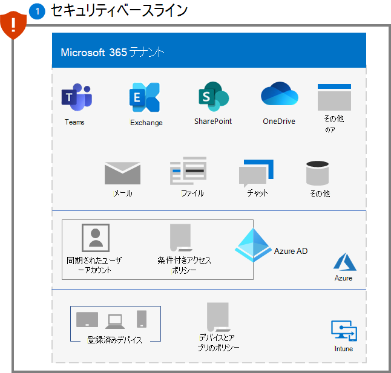

# 手順 1. セキュリティ 基準を構成する

ランサムウェアの攻撃者に対抗する最初の手順として、次の Microsoft 定義のセキュリティ 基準を構成する必要があります。

- [Microsoft 365 セキュリティ](#microsoft-365-security-baseline)
- [Exchange メール管理](#exchange-email-management-baseline)
- [Windows デバイスとクライアント ソフトウェアベースラインの追加](#additional-baselines)

これらのベースラインには、構成設定と、攻撃者によってよく知られているルールが含まれています。これらの設定がない場合は、すぐに気付づかれて、一般的に悪用されます。

## Microsoft 365 セキュリティ 基準基準

まず [Microsoft Secure Score](/microsoft-365/security/defender/microsoft-secure-score) を使用してセキュリティ態勢を評価および測定し、指示に従って必要に応じて改善します。

次に、[攻撃表面の縮小ルール](/microsoft-365/security/defender-endpoint/attack-surface-reduction)を使用して、疑わしいアクティビティと脆弱なコンテンツをブロックします。これらのルールには以下を防止するものが含まれています:

- すべての Office アプリケーションによる子プロセスの作成
- メール クライアントと Web メールからの実行可能なコンテンツ
- 有病率、年齢、または信頼できるリストの条件を満たさない場合の実行可能ファイルの実行
- 難読化される可能性のあるスクリプトの実行
- JavaScript または VBScript によるダウンロードした実行可能コンテンツの起動
- Office アプリケーションによる実行可能なコンテンツの作成
- Office アプリケーションによる他のプロセスへのコード挿入
- Office の通信アプリケーションによる子プロセスの作成
- USB から実行される信頼されていないプロセスと署名されていないプロセス
- Windows 管理インターフェイス (WMI) イベント サブスクリプションによる永続化
- Windows ローカル セキュリティ機関サブシステムからの資格情報の盗用 (lsass.exe)
- PSExec コマンドと WMI コマンドから発生するプロセス作成

## Exchange メール管理基準 

Exchange メール 基準設定を使用して、テナントに対して電子メール ベースの攻撃の最初のアクセスが起きないように支援します。

- 電子メールMicrosoft Defender ウイルス対策メール スキャンを有効にします。
- Microsoft Defender for Office 365 を使用して、新しい脅威や多型バリアントに対する [強化されたフィッシング保護](/microsoft-365/security/office-365-security/anti-phishing-protection)とカバレッジを提供します。
- Office 365 メール フィルター の設定を確認して、スプーフィングされたメール、スパム、マルウェア付きのメールをブロックします。 Microsoft Defender for Office 365 を使用して、新しい脅威や多型バリアントに対する強化されたフィッシング保護とカバレッジを提供します。 Defender for Office 365 を構成して、リンクを [再確認して](/microsoft-365/security/office-365-security/atp-safe-links)をクリックして、配信されたメールの[削除を新しく取得した脅威インテリジェンスに](/microsoft-365/security/office-365-security/zero-hour-auto-purge)応じて行います。
- EOP および Defender for Office 365 のセキュリティのための [推奨設定を確認し、最新版に更新します](/microsoft-365/security/office-365-security/recommended-settings-for-eop-and-office365-atp)。
- Defender for Office 365 を構成して、リンクを [再確認して](/microsoft-365/security/office-365-security/set-up-safe-links-policies)をクリックして、新しく取得した脅威インテリジェンスに応じて、配信されたメールの削除を行います。

## 追加の基準計画

次に [セキュリティ基準](https://techcommunity.microsoft.com/t5/microsoft-security-baselines/bg-p/Microsoft-Security-Baselines)を適用 します。

- Microsoft Windows 10
- Microsoft 365 Apps for Enterprise
- Microsoft Edge

## ユーザーへの影響と変更管理

攻撃表面の縮小ルールのベスト プラクティスとして、ルールがネットワークに与える影響を評価するには、脅威と脆弱性の管理のルールについてのセキュリティ推奨事項を検討します。 推奨事項の詳細ウィンドウには、ユーザーの影響が表示され、それを使用して、ユーザーの生産性に悪影響を及ぼさずに、ブロック モードでルールを有効にすることによって、新しいポリシーを受け入れることが可能なデバイスの割合を特定できます。

さらに、Exchange メール基準設定を使用すると、受信メールがブロックされ、メールの送信やメール内のリンクのクリックを防ぐことが可能です。 この動作と、これらの予防措置が講じられる理由について、従業員に教育します。

## 最終的な構成

この手順の後の、テナントのランサムウェア保護を次に示します。

## 次の手順

[手順 2 ](ransomware-protection-microsoft-365-attack-detection-response.md)に進み、Microsoft 365 テナントのための攻撃検出および応答機能を展開します。
