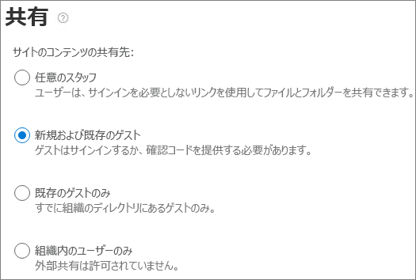

# 組織外のユーザーと共有する場合、ファイルが偶発的に公開されることを制限する

ファイルやフォルダーを組織外のユーザーと共有する場合、機密情報を誤って共有する可能性を減らすことができるさまざまなオプションがあります。 組織のニーズに合わせて、この記事のオプションから選択できます。

## [すべてのユーザー] リンクのベスト プラクティスを使用する

組織内のユーザーが認証されていない共有を行う必要があるが、認証されていないユーザーがコンテンツを変更することを懸念している場合は、組織で認証されていない共有を行う方法のガイダンスについて、「[認証されていない共有のベスト プラクティス](best-practices-anonymous-sharing.md)」を参照してください。

## [すべてのユーザー] リンクをオフにする

適切なコンテンツに対して [*すべてのユーザー*] リンクを有効にしておくことをお勧めします。これは、共有の最も簡単な方法であり、ユーザーが IT 部門の管理外にある他のソリューションを求めるリスクを軽減できるためです。 [*すべてのユーザー*] リンクを他の人に転送できますが、リンクを持っているユーザーのみファイルへアクセスできます。

組織外のユーザーが SharePoint、グループ、または Teams のコンテンツにアクセスするときに常に認証を行う場合は、*Anyone* 共有をオフにすることができます。これにより、ユーザーはコンテンツの認証されていない共有を防ぐことができます。

[*すべてのユーザー*] リンクを無効にしても、ユーザーは [*特定のユーザー*] リンクを使用してゲストと簡単に共有できます。 この場合、すべての組織外のユーザーは、共有コンテンツにアクセスする前に認証を受ける必要があります。

ニーズに応じて、特定のサイトまたは組織全体の [*すべてのユーザー*] リンクを無効にできます。

組織の [*すべてのユーザー*] リンクをオフにするには

1. SharePoint 管理センターの左側のナビゲーションで、<a href="https://go.microsoft.com/fwlink/?linkid=2185222" target="_blank">**[共有]**</a> を選択します。
2. SharePoint 外部共有設定を [**新規および既存のゲスト**] に設定します。

   

3. [**保存**] をクリックします。

サイトの [*すべてのユーザー*] リンクをオフにするには

1. SharePoint 管理センターの左側のナビゲーションで、[**サイト**] を展開して [<a href="https://go.microsoft.com/fwlink/?linkid=2185220" target="_blank">**アクティブなサイト**</a>] を選択します。
2. 構成するサイトを選択します。
3. リボンで、[**共有**] を選択します。
4. 共有が [**新規および既存のゲスト**] に設定されていることを確認します。

   

5. 変更した場合は、**[保存]** を選択します。

## ドメインのフィルター処理

ドメイン許可または拒否リストを使用して、ユーザーが組織外のユーザーとの共有を行うときに使用できるドメインを指定できます。

許可リストを使用すると、組織内のユーザーが組織外のユーザーと共有できるドメインのリストを指定できます。 他のドメインとの共有はブロックされています。 組織が特定のドメイン リストのユーザーとのみ共同作業を行う場合、この機能を使用して他のドメインとの共有を防ぐことができます。

拒否リストを使用すると、組織内のユーザーが組織外のユーザーと共有できないドメインのリストを指定できます。 リストのドメインとの共有はブロックされています。 これは、たとえば、組織内のコンテンツへのアクセスを禁止したい競合相手がいる場合に役立ちます。

許可リストと拒否リストは、ゲストとの共有にのみ影響します。 禁止されたドメインのユーザーは、無効にしていない場合は、[*すべてのユーザー*] リンクを使用して共有できます。 ドメインの許可リストと拒否リストで最良の結果を得るには、上記のように [*すべてのユーザー*] リンクを無効にすることを検討してください。

ドメイン許可リストまたは拒否リストを設定するには

1. SharePoint 管理センターの左側のナビゲーションで、<a href="https://go.microsoft.com/fwlink/?linkid=2185222" target="_blank">**[共有]**</a> を選択します
2. [**外部共有の詳細設定**] で、[**ドメインごとに外部共有を制限する**] チェックボックスをオンにします。
3. [**ドメインを追加**] をクリックします。
4. ドメインをブロックするかどうかを選択し、ドメインを入力して、[**OK**] をクリックします。

   

5. [**保存**] をクリックします。

SharePoint および OneDrive よりも高いレベルでドメインによる共有を制限する場合、Azure Active Directory で「[B2B ユーザーに対する特定組織からの招待を許可またはブロック](/azure/active-directory/b2b/allow-deny-list)」できます。 (これらの設定を SharePoint と OneDrive に反映させるには、[SharePoint および OneDrive の Azure AD B2B プレビューとの統合](/sharepoint/sharepoint-azureb2b-integration-preview)を構成する必要があります。)

## 組織外のユーザーとのファイル、フォルダー、およびサイトの共有を特定のセキュリティ グループに制限する

組織外のユーザーとのファイル、フォルダー、およびサイトの共有を特定のセキュリティ グループのメンバーに制限できます。 これは、外部共有を有効にしたいが、承認ワークフローまたは要求プロセスを使用する場合に便利です。 あるいは、ユーザーがセキュリティ グループに追加され、外部との共有が許可される前に、ユーザーにトレーニング コースの完了を要求する可能性もあります。

セキュリティ グループのメンバーに外部共有を制限するには

1. SharePoint 管理センターの左側のナビゲーションにある **[ポリシー]** で、<a href="https://go.microsoft.com/fwlink/?linkid=2185222" target="_blank">**[共有]**</a> を選択します。
2. **[外部共有]** で、**[その他の外部共有の設定]** を展開します。

3. **[特定のセキュリティ グループ内のユーザーにのみ、外部との共有を許可する]** を選択し、**[セキュリティ グループを管理する]** を選択します。

    ![[セキュリティグループを管理する] パネルのスクリーンショット。](/sharepoint/sharepointonline/media/manage-security-groups.png)

4. **[セキュリティ グループを追加する]** ボックスに、セキュリティ グループの名前を入力します。[セキュリティ グループ] ボックスが表示されます。

5. セキュリティ グループ名の横にある **[共有可能]** ドロップダウンから、次のいずれかを選択します。

    - **認証されたゲストのみ** (既定値)
    - **すべてのユーザー**

6. **[保存]** を選択します。

これは、ファイル、フォルダー、およびサイトに影響しますが、Microsoft 365 グループまたは Teams には影響しません。 メンバーがゲストを非公開 Microsoft 365 グループまたは Microsoft Teams の非公開チームに招待すると、招待は認証のためにグループまたはチームの所有者に送信されます。

## 関連項目

[セキュリティで保護されたゲスト共有の環境を作成する](create-secure-guest-sharing-environment.md)

[匿名ユーザーとファイルおよびフォルダーを共有するためのベスト プラクティス](best-practices-anonymous-sharing.md)
