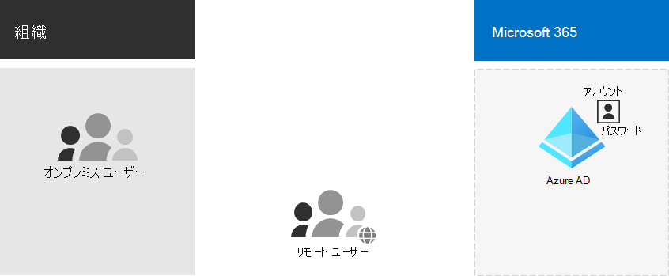

# 手順 3. エンタープライズ テナントのMicrosoft 365の ID

Microsoft 365 テナントには、サインインの ID と認証を管理するAzure Active Directory (Azure AD) テナントが含まれています。組織のユーザー アクセスとアクセス許可Microsoft 365管理するには、ID インフラストラクチャを正しく構成することが不可欠です。

## クラウドのみのハイブリッドとハイブリッド

2 種類の ID モデルとその最適な機能と利点を次に示します。

| モデル | 説明 | ユーザー資格情報Microsoft 365認証する方法 | 最適シナリオ | 最大の利点 |
|:-------|:-----|:-----|:-----|:-----|
| クラウド専用 | ユーザー アカウントは、Microsoft 365 テナントのAzure AD テナントにのみ存在します。 | Microsoft 365 テナントのAzure AD テナントは、クラウド ID アカウントを使用して認証を実行します。 | オンプレミスの Active Directoryを持っていない、または必要ない組織。 | 使いやすいです。 追加のディレクトリ ツールやサーバーは必要ありません。 |
| ハイブリッド |  ユーザー アカウントはオンプレミスの Active Directory Domain Services (AD DS) に存在し、コピーはMicrosoft 365 テナントのAzure AD テナントにも存在します。 Azure AD Connectは、オンプレミス サーバーで実行され、AD DS の変更をAzure AD テナントに同期します。 Azure ADのユーザー アカウントには、既にハッシュされた AD DS ユーザー アカウントパスワードのハッシュバージョンも含まれる場合があります。 | Microsoft 365 テナントのAzure AD テナントは、認証プロセスを処理するか、ユーザーを別の ID プロバイダーにリダイレクトします。 | AD DS または別の ID プロバイダーを使用している組織。 | ユーザーは、オンプレミスまたはクラウドベースのリソースにアクセスするときに同じ資格情報を使用できます。 |
||||||

クラウドのみの ID の基本的なコンポーネントを次に示します。

この図では、オンプレミスユーザーとリモート ユーザーが、Microsoft 365 テナントのAzure AD テナント内のアカウントでサインインします。

ハイブリッド ID の基本的なコンポーネントを次に示します。

この図では、オンプレミスユーザーとリモート ユーザーは、オンプレミスの AD DS からコピーされたAzure AD テナント内のアカウントを使用して、Microsoft 365 テナントにサインインします。

## オンプレミス AD DS の同期

ビジネス ニーズと技術的要件に応じて、ハイブリッド ID モデルとディレクトリ同期は、Microsoft 365を採用しているエンタープライズ顧客にとって最も一般的な選択肢です。 ディレクトリ同期を使用すると、AD DS で ID を管理でき、ユーザー アカウント、グループ、連絡先に対するすべての更新は、Microsoft 365 テナントのAzure AD テナントに同期されます。

> [!NOTE]
> AD DS ユーザー アカウントが初めて同期されると、自動的にMicrosoft 365 ライセンスが割り当てられず、メールなどのMicrosoft 365サービスにアクセスできません。 最初に、使用場所を割り当てる必要があります。 次に、グループ メンバーシップを使用して、これらのユーザー アカウントに個別または動的にライセンスを割り当てます。

ハイブリッド ID モデルを使用する場合の 2 種類の認証を次に示します。

| 認証の種類 | 説明 |
|:-------|:-----|
| 管理された認証 | Azure ADは、ローカルに格納されたハッシュバージョンのパスワードを使用して認証プロセスを処理するか、オンプレミスの AD DS によって認証されるオンプレミスのソフトウェア エージェントに資格情報を送信します。      マネージド認証には、パスワード ハッシュ同期 (PHS) とパススルー認証 (PTA) の 2 種類があります。 PHS では、Azure ADは認証自体を実行します。 PTA では、AD DS が認証を実行Azure AD。 |
| フェデレーション認証 | Azure AD認証を要求しているクライアント コンピューターを別の ID プロバイダーにリダイレクトします。 |
|  |  |

詳細については [、適切な認証方法の選択](/azure/active-directory/hybrid/choose-ad-authn) に関するページを参照してください。

## 強力なサインインを強制する

ユーザー サインインのセキュリティを強化するには、次の表の機能と機能を使用します。

| 機能 | 説明 | 詳細情報 | ライセンスの要件 |
|:-------|:-----|:-----|:-----|:-----|
| Windows Hello for Business | Windows デバイスにサインオンするときに、パスワードを強力な 2 要素認証に置き換えます。 この 2 要素認証は、デバイスと生体認証または PIN に関連付けられる新しい種類のユーザー資格情報です。 | [Windows Hello for Business の概要](/windows/security/identity-protection/hello-for-business/hello-overview) | Microsoft 365 E3 または E5 |
| Azure AD パスワード保護 | 既知の脆弱なパスワードとそのバリアントを検出してブロックし、組織に固有の追加の脆弱な用語をブロックすることもできます。 | [Azure ADパスワード保護を構成する](/azure/active-directory/authentication/concept-password-ban-bad) | Microsoft 365 E3 または E5 |
| 多要素認証 (MFA) を使用する | MFA では、ユーザー サインインが、スマートフォン アプリでの検証やスマートフォンに送信されたテキスト メッセージなど、ユーザー アカウントのパスワードを超えた別の検証の対象となる必要があります。 ユーザーが MFA を設定する方法については、 [このビデオ](https://support.microsoft.com/office/set-up-multi-factor-authentication-in-microsoft-365-business-a32541df-079c-420d-9395-9d59354f7225) を参照してください。 | [エンタープライズ向けのMicrosoft 365用 MFA](../enterprise/microsoft-365-secure-sign-in.md#mfa) | Microsoft 365 E3 または E5 |
| ID とデバイスのアクセス構成 | 推奨される前提条件機能と、条件付きアクセス、Intune、Azure AD Identity Protection ポリシーと組み合わされた設定で構成される設定とポリシー。  | [ID とデバイスのアクセス構成](../security/office-365-security/microsoft-365-policies-configurations.md) | Microsoft 365 E3 または E5 |
| Azure AD Identity Protection | 資格情報の侵害から保護します。攻撃者は、組織のクラウド サービスとデータにアクセスするためにユーザーのアカウント名とパスワードを決定します。 | [Azure AD Identity Protection](/azure/active-directory/active-directory-identityprotection) | Identity & Threat Protection アドオンを使用したMicrosoft 365 E5またはMicrosoft 365 E3 |
|  |  |  |

## 手順 3 の結果

Microsoft 365 テナントの ID については、次のことを決定しました。

- 使用する ID モデル。
- 強力なユーザーとデバイスへのアクセスを強制する方法。

新しいハイブリッド ID 要素が強調表示されているテナントの例を次に示します。

この図では、テナントには次のものがあります。

- ディレクトリ同期サーバーとAzure AD Connectを使用して、Azure AD テナントと同期される AD DS フォレスト。
- AD DS フォレストからの AD DS ユーザー アカウントとその他のオブジェクトのコピー。
- ユーザー アカウントに基づいてセキュリティで保護されたユーザー サインインとアクセスを強制する一連の条件付きアクセス ポリシー。

## ID の継続的なメンテナンス

継続的に、次の操作が必要になる場合があります。

- ユーザー アカウントとグループを追加または変更します。 クラウド専用 ID の場合は、Microsoft 365 管理センターや PowerShell などのAzure AD ツールを使用して、クラウドベースのユーザーとグループを管理します。 ハイブリッド ID の場合は、AD DS ツールを使用してオンプレミスのユーザーとグループを維持します。
- ID とデバイスのアクセス構成を追加または変更して、サインイン のセキュリティ要件を適用します。

## 次の手順

[移行](tenant-management-migration.md)を続行して、オンプレミスのOffice サーバーとそのデータをMicrosoft 365に移行します。