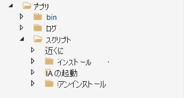
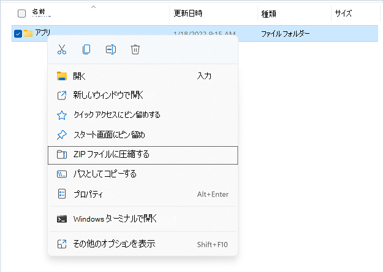

# <a name="build-a-package"></a>パッケージをビルドする
パッケージは、アプリケーション バイナリ.zipテスト スクリプトを含むパッケージ ファイルであり、テスト ベースを使用するための前提条件です。 このクイック スタートでは、最初のパッケージをビルドし、アプリケーションでアウトオブボックス テストを実行できます。 
  
*    *アウト **オブボックス (OOB)** テストでは、アプリケーションのインストール、起動、閉じる、アンインストールを実行します。インストール後、1 回のアンインストールが実行される前に、起動終了ルーチンが 30 回繰り返されます。OOB テストでは、パッケージ上で標準化されたテレメトリを提供し、さまざまなビルドWindowsします。*  
    
必要に応じて、サンプル パッケージ [をダウンロードして参照](https://aka.ms/testbase-sample-package) し、最初に実行できます。 

## <a name="create-a-folder-structure"></a>フォルダー構造の作成 

ローカル コンピューターで、次のようにフォルダー構造を作成します。<br> 


次のフォルダーが使用されます。
* **App\bin**: アプリケーションと依存関係バイナリを保存します。<br> 
* **App\scripts**: スクリプトを保存して、アプリケーションのインストール、起動、終了、アンインストールを行います。<br> 
* **App\logs**: スクリプトはログをこのフォルダーに出力する必要があります。その後、テストが完了した後にログをダウンロードして分析できます。<br> 

## <a name="copy-binary-files"></a>バイナリ ファイルのコピー
アプリケーション インストール ファイルを **App\bin にコピーします**。 アプリケーションに依存関係がある場合は、最初にインストールする必要があります。 また、依存関係のインストール ファイルを **App\bin にコピーします**。<br> 


## <a name="add-powershell-scripts"></a>PowerShell スクリプトの追加
OOB テストを実行するには、PowerShell スクリプトを追加して、アプリケーションのインストール、起動、終了、アンインストールを行う必要があります。
> [!NOTE]  
> *OOB テストでは、インストール、起動、* 閉じるスクリプトが必要ですが、アンインストール スクリプトはオプションです。
    
スクリプトは、次のようにフォルダーに追加する必要があります。  


スクリプトには通常、次の動作が含まれます。<br> 
-   **コマンドを実行して、アプリケーションをインストール/起動/閉じる/アンインストールします**。 例:アプリケーションが MSI ファイルの場合は、 [msiexec を実行してインストール](/windows-server/administration/windows-commands/msiexec) します。 <br> 
-   **インストール/起動/終了/** アンインストール操作の結果を確認し、結果が予想される場合は終了コードを返します。 Test Base は、ゼロ以外の終了コードを返す場合、スクリプトの実行を失敗としてマークします。<br> 
-   **十分なログを保存** し、将来の使用のために適切なログを保存します。<br> 

以下の例を参照してください。 ファイルにコピーするだけで、必要に応じて変更を加えることもできます。 <br>

**インストール スクリプトの例 (App\scripts\install\job.ps1)**
```powershell
        push-location $PSScriptRoot
        $exit_code = 0
        $script_name = $myinvocation.mycommand.name
        $log_dir = "$PSScriptRoot\..\..\logs"
        $log_file = "$log_dir\$script_name.log"


        if(-not (test-path -path $log_dir )) {
            new-item -itemtype directory -path $log_dir
        }

        Function log {
           Param ([string]$log_string)
           write-host $log_string
           add-content $log_file -value $log_string
        }

        log("Installing TestBaseM365 Digital Clock")
        push-location "..\..\bin"
        if ([Environment]::Is64BitProcess) {
            $installer_name = "TestBaseM365DigitalClock.msi"
        }
        else {
            $installer_name = "TestBaseM365DigitalClock.msi"
        }
        $arguments = "/i "+$installer_name+" /quiet /L*v "+"$log_dir"+"\atp-client-installation.log"

        $installer = Start-Process msiexec.exe $arguments -wait -passthru
        pop-location

        if ($installer.exitcode -eq 0) {
            log("Installation succesful as $($installer.exitcode)")
        }
        else {
            log("Error: Installation failed as $($installer.exitcode)")
            $exit_code = $installer.exitcode
        }

        log("Installation script finished as $exit_code")
        pop-location
        exit $exit_code
```

**起動スクリプトの例 (App\scripts\launch\job.ps1)**
```powershell
        push-location $PSScriptRoot
        $exit_code = 0
        $script_name = $myinvocation.mycommand.name
        $log_dir = "$PSScriptRoot\..\..\logs"
        $log_file = "$log_dir\$script_name.log"

        if(-not (test-path -path $log_dir )) {
            new-item -itemtype directory -path $log_dir
        }

        Function log {
           Param ([string]$log_string)
           write-host $log_string
           add-content $log_file -value $log_string
        }

        log("Launch TestBaseM365 Digital Clock")

        $PROCESS_NAME = "DigitalClock"
        $exePath = "C:\Program Files\Test Base M365\DigitalClock\DigitalClock.exe"

        Start-Process -FilePath $exePath

         if (Get-Process -Name $PROCESS_NAME) {
                log("Launch successfully $PROCESS_NAME...") 
                $exit_code = 0
         }
         else {
            log("Not launched $PROCESS_NAME...") 
            $exit_code = 1
         }

        log("Launch script finished as $exit_code")
        pop-location
        exit $exit_code 
```

## <a name="compress-to-zip-file"></a>圧縮して zip ファイルに変換する
スクリプトとバイナリを準備した後、フォルダーを圧縮して zip ファイルに移動します。 [アプリ] フォルダーを右クリックし、[圧縮して **ZIP ファイル] を選択します**。<br>



## <a name="verify-your-package-locally-optional"></a>パッケージをローカルで確認する (オプション)
zip パッケージを構築した後、テストベース アカウントにアップロードできます。 <br>
ただし、アップロードする前にスクリプトが正しく動作するために、テストをローカルで実行するのがベスト プラクティスです。 ローカル テストでは、問題をすばやく特定し、アップロード プロセスをスピードアップできます。 ローカルで確認するには、以下の手順に従います。<br>
1.  VM の準備 (仮想マシン)<br>
    このローカル テストには仮想マシンを使用することをお勧めします。これは、テストごとにクリーン なWindows環境が現在必要とされています。 Azure で Windows VM (クイック スタート [: Windows](/azure/virtual-machines/windows/quick-create-portal) 仮想マシン) を簡単に作成できます。テストに適した Windows バージョン (イメージ) を選択できます (Windows 10 Pro バージョン *21H2* など)。<br>

2.  パッケージを VM にコピーする<br>
    パッケージ ファイルを VM にコピーする方法は多数あります。 Azure VM を使用している場合は、次の方法を選択できます。
     -  リモート デスクトップ接続でファイルを直接コピーします。 <br>
     -  Azure ファイル共有を使用する ([クイック スタート: Azure ファイルの作成と管理](/azure/storage/files/storage-files-quick-create-use-windows))
    
    このテスト用に特定のフォルダーを作成し、このフォルダーの下にパッケージ ファイルをコピーできます。 例: *C:\TestBase*。<br>
3.  パッケージをテストする<br>
    [Windows PowerShellを開き、パッケージを含むディレクトリ (cd C:\TestBase など) に切り替えて、パッケージでテストの実行を開始します。<br>
    a.   パッケージ ファイルを抽出します。
     -  *Expand-Archive -LiteralPath C:\TestBase\App.zip -DestinationPath C:\TestBase*<br>
    
    b.  インストール スクリプトを実行します。  
     -  *C:\TestBase\App\scripts\install\job.ps1*<br>
    
    c.  必要に応じて VM を再起動します。<br>
    
    d.  起動スクリプトを実行します。
     -  *C:\TestBase\App\scripts\install\job.ps1*<br>
    
    e.  閉じるスクリプトを実行します。
     -  *C:\TestBase\App\scripts\close\job.ps1*<br>
    
    f.  アンインストール スクリプトを実行します (インストールされている場合)。
     -  *C:\TestBase\App\scripts\uninstall\job.ps1*<br>
    
    各手順の後で、スクリプトに問題が発生した場合に確認できます。 すべてのスクリプトが予想通り実行される場合は、パッケージを Test Base アカウントにアップロードする準備が整います。


## <a name="next-steps"></a>次の手順
[アップロードを作成する](uploadApplication.md)
 
 
