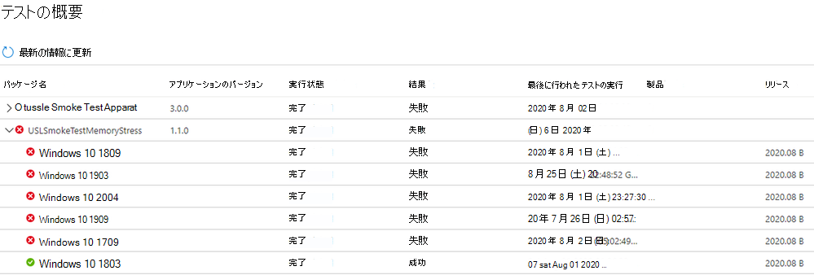

# <a name="memory-regression-analysis"></a>メモリ回帰分析

テスト ベースを使用すると、アプリを実行しているテスト VM のメモリ使用量が大幅に増加することがわかります。 メモリ使用量などのパフォーマンス メトリックは、アプリケーション全体の正常性を示す可能性があり、この追加により、アプリのパフォーマンスを最適に維持するのに大いに役立つと考えています。

詳細については、こちらのビデオをご覧になるか、最新の機能強化について簡単に説明します。 

回帰分析に役立つ M365 の Test Base の機能の詳細については、「プロセスの信頼性に基づく回帰結果」を参照してください。

<b>メモリの回帰を詳しく見る</b>

M365 のテスト ベース ダッシュボードには、新しいプレリリースWindows更新プログラムでアプリケーションによって消費されたメモリが表示され、最後にリリースされたWindows更新プログラムで使用されたメモリと比較されます。 

今月の機能強化により、お気に入りのプロセスでメモリ回帰分析が取り上されるようになりました。 アプリケーションには複数のプロセスを含めることができます。また、[信頼性] タブでお気に入りのプロセスを手動で選択できます。その後、このサービスでは、さまざまなWindows更新リリース間でテスト実行を比較しながら、これらのお気に入りのプロセスのメモリ回帰を識別します。 回帰が検出された場合は、回帰に関する詳細を簡単に入手できます。

次に、この機能を詳しく見て、Windows パフォーマンス アナライザーを使用してメモリの回帰をトラブルシューティングする方法について説明します。

メモリの回帰によって引き起こされる障害シグナルは、[メモリ使用率] の [テスト結果] ページの [M365 のテスト ベース] ダッシュボードに表示されます。


メモリ消費量の増加によるアプリケーションのエラーは、[テストの概要] ページにも表示されます ```Fail``` 。



これらの障害シグナルを事前に提供することで、アプリケーションのエンド ユーザー エクスペリエンスを中断し、影響を与える可能性のある問題に明確にフラグを設定することが目標です。 

その後、ログ ファイルをダウンロードし、Windows パフォーマンス アナライザーまたは好みのツールキットを使用して詳細を調査できます。 また、問題の修復に関して M365 の Test Base チームと共同で作業し、エンド ユーザーに影響を与える問題を防ぐのに役立ちます。

メモリ信号は、すべてのテスト実行について、M365 サービスのテスト ベースの [メモリ使用率] タブにキャプチャされます。 次の例は、プレリリース 2020 年 8 月のセキュリティ更新プログラムに対するオンボード アプリケーション "Smoke Test Memory Stress" を使用した最近のテスト実行を示しています。 (このアプリケーションは、メモリの回帰を説明するためにチームによって作成されました。


この例では、お気に入りのプロセス "USLTestMemoryStress.exe" プロセスでは、リリースされた 7 月の更新プログラムと比較して、リリース前の 8 月の更新プログラムで平均約 100 MB が消費されたため、M365 のテスト ベースでは回帰が特定されました。 

"USLTestMemoryStress_Aux1.exe" と "USLTestMemoryStress_Aux2.exe" としてここに示されている他のプロセスも同じアプリケーションに属しますが、2 つのリリースでほぼ同じ量のメモリが消費され、"合格" され、正常であると見なされました。

メイン プロセスの回帰は"統計的に有意" であると判断されたため、サービスはこの違いをユーザーに伝え、強調表示しました。 比較が統計的に有意でない場合は、強調表示されません。 メモリ使用率がノイズの多い場合があるため、統計モデルを使用して、ビルドとリリース間で、重要な相違点と意味のある違いを区別します。 

真の差 (偽陽性) がない場合、比較にフラグが設定されることはほとんどありませんが、これは回帰 (または真陽性) を正しく識別する可能性を高めるために必要なトレードオフです。

次の手順では、メモリ回帰の原因を理解します。 次に示すように、[ログ ファイルのダウンロード] オプションから、両方の実行の zip ファイルをダウンロードできます。 

これらの zip ファイルには、ETL ファイルに含まれるスクリプト結果やメモリ、CPU パフォーマンス データなど、テスト実行の結果が含まれます。


2 つのテスト実行のログをダウンロードして解凍し、各フォルダー内の ETL ファイルを見つけて、それらを target.etl (リリース前の更新でのテスト実行の場合) と baseline.etl (前回リリースされた更新時のテスト実行の場合) として名前を変更して、探索とナビゲーションを簡略化できます。
 
## <a name="next-steps"></a>次の手順

インテリジェントな CPU 回帰分析について理解するには、次の記事に進んでください。
> [!div class="nextstepaction"]
> [次の手順](cpu.md)

<!---
Add button for next page
-->
